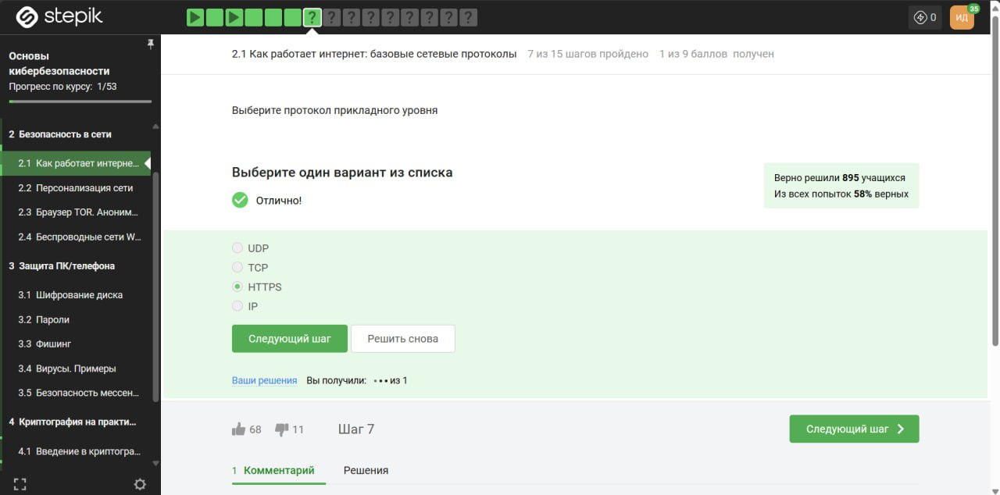
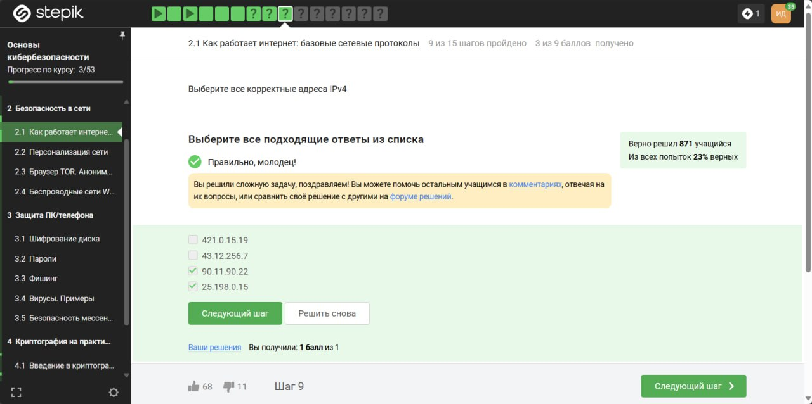
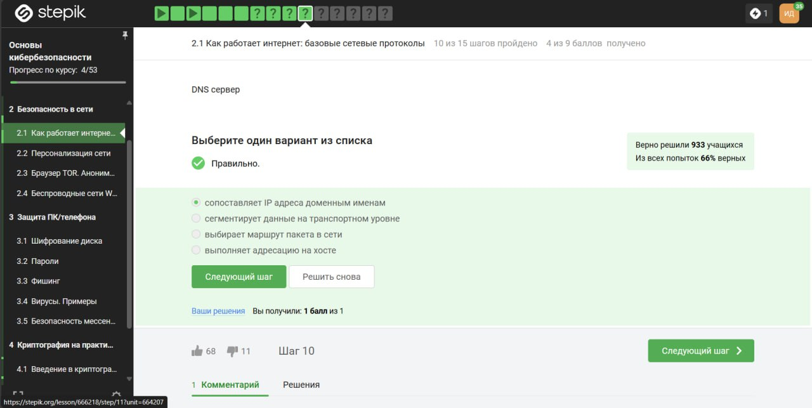
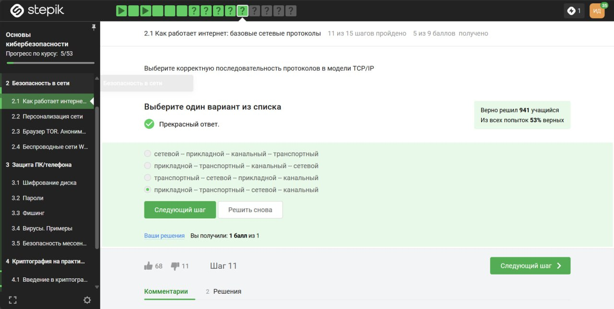
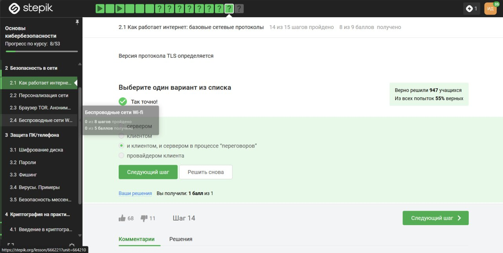
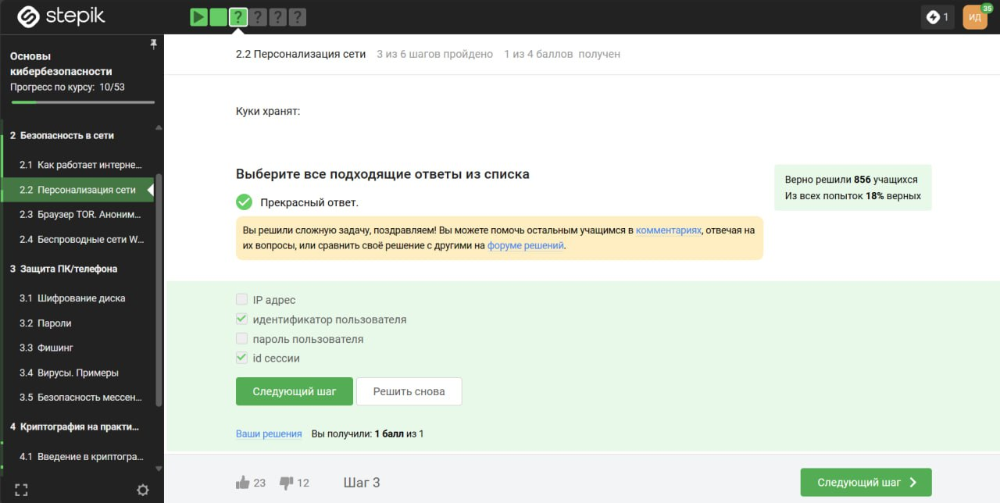
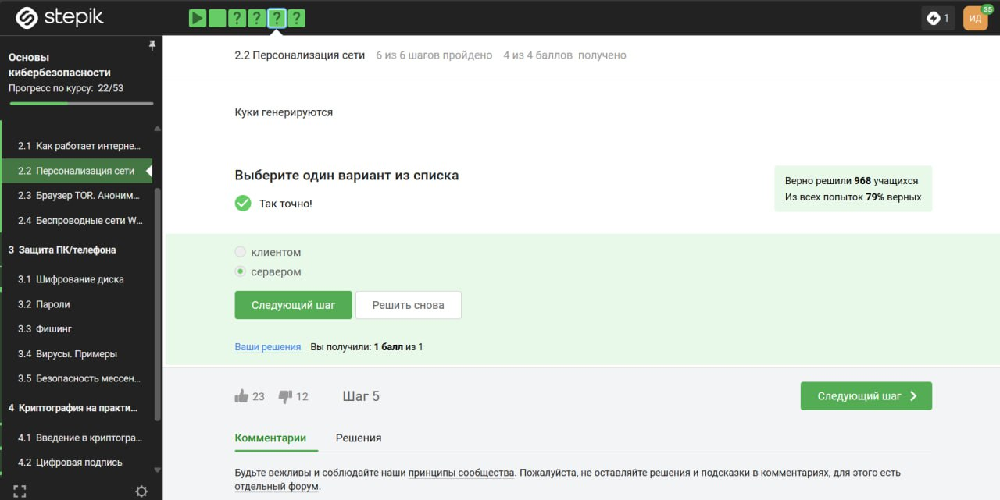

---
## Front matter
title: "Отчёт по лабораторной работе №2"
subtitle: "Дискреционное разграничение прав в Linux. Основные атрибуты"
author: "Дарья Эдуардовна Ибатулина"

## Generic otions
lang: ru-RU
toc-title: "Содержание"

## Bibliography
bibliography: bib/cite.bib
csl: pandoc/csl/gost-r-7-0-5-2008-numeric.csl

## Pdf output format
toc: true # Table of contents
toc-depth: 2
lof: true # List of figures
lot: true # List of tables
fontsize: 12pt
linestretch: 1.5
papersize: a4
documentclass: scrreprt
## I18n polyglossia
polyglossia-lang:
  name: russian
  options:
	- spelling=modern
	- babelshorthands=true
polyglossia-otherlangs:
  name: english
## I18n babel
babel-lang: russian
babel-otherlangs: english
## Fonts
mainfont: PT Serif
romanfont: PT Serif
sansfont: PT Sans
monofont: PT Mono
mainfontoptions: Ligatures=TeX
romanfontoptions: Ligatures=TeX
sansfontoptions: Ligatures=TeX,Scale=MatchLowercase
monofontoptions: Scale=MatchLowercase,Scale=0.9
## Biblatex
biblatex: true
biblio-style: "gost-numeric"
biblatexoptions:
  - parentracker=true
  - backend=biber
  - hyperref=auto
  - language=auto
  - autolang=other*
  - citestyle=gost-numeric
## Pandoc-crossref LaTeX customization
figureTitle: "Рис."
tableTitle: "Таблица"
listingTitle: "Листинг"
lofTitle: "Список иллюстраций"
lotTitle: "Список таблиц"
lolTitle: "Листинги"
## Misc options
indent: true
header-includes:
  - \usepackage{indentfirst}
  - \usepackage{float} # keep figures where there are in the text
  - \floatplacement{figure}{H} # keep figures where there are in the text
---

# Цель работы

Получение практических навыков работы в консоли с атрибутами файлов, закрепление теоретических основ дискреционного разграничения доступа в современных системах с открытым кодом на базе ОС Linux.

# Задание

1. В установленной при выполнении предыдущей лабораторной работы операционной системе создайте учётную запись пользователя guest (использую учётную запись администратора):
`useradd guest`
2. Задайте пароль для пользователя guest (использую учётную запись администратора):
`passwd guest`
3. Войдите в систему от имени пользователя guest.
4. Определите директорию, в которой вы находитесь, командой pwd. Сравните её с приглашением командной строки. Определите, является ли она вашей домашней директорией? Если нет, зайдите в домашнюю директорию.
5. Уточните имя вашего пользователя командой whoami.
6. Уточните имя вашего пользователя, его группу, а также группы, куда входит пользователь, командой id. Выведенные значения uid, gid и др. запомните. Сравните вывод id с выводом команды groups.
7. Сравните полученную информацию об имени пользователя с данными, выводимыми в приглашении командной строки.
8. Просмотрите файл /etc/passwd командой
`cat /etc/passwd`
Найдите в нём свою учётную запись. Определите uid пользователя. Определите gid пользователя. Сравните найденные значения с полученными в предыдущих пунктах. Замечание: в случае, когда вывод команды не умещается на одном экране монитора, используйте прокрутку вверх–вниз (удерживая клавишу shift, нажимайте page up и page down) либо качестве фильтра для вывода только строк, содержащих определённые буквенные сочетания:
`cat /etc/passwd | grep guest`
9. Определите существующие в системе директории командой
`ls -l /home/`
Удалось ли вам получить список поддиректорий директории /home? Какие права установлены на директориях?
10. Проверьте, какие расширенные атрибуты установлены на поддиректориях, находящихся в директории /home, командой:
`lsattr /home`
Удалось ли вам увидеть расширенные атрибуты директории? Удалось ли вам увидеть расширенные атрибуты директорий других пользователей?
11. Создайте в домашней директории поддиректорию dir1 командой
`mkdir dir1`
Определите командами `ls -l` и `lsattr`, какие права доступа и расширенные атрибуты были выставлены на директорию dir1.
12. Снимите с директории dir1 все атрибуты командой
`chmod 000 dir1`
и проверьте с её помощью правильность выполнения команды
`ls -l`
13. Попытайтесь создать в директории dir1 файл file1 командой
`echo "test" > /home/guest/dir1/file1`
Объясните, почему вы получили отказ в выполнении операции по созданию файла? Оцените, как сообщение об ошибке отразилось на создании файла? Проверьте командой
`ls -l /home/guest/dir1`
действительно ли файл file1 не находится внутри директории dir1.
14. Заполните таблицу «Установленные права и разрешённые действия», выполняя действия от имени владельца директории (файлов), определив опытным путём, какие операции разрешены, а какие нет. Если операция разрешена, занесите в таблицу знак "+", если не разрешена, то "-".
15. На основании заполненной таблицы определите те или иные минимально необходимые права для выполнения операций внутри директории dir1, заполните таблицу "Минимальные права для совершения операций".

# Теоретическое введение

В основе механизмов разграничения прав доступа лежат имена пользователей и имена групп пользователей. В Linux каждый пользователь имеет уникальное имя, под которым он входит в систему (логируется). Кроме того, в системе создается некоторое число групп пользователей, причем каждый пользователь может быть включен в одну или несколько групп.

Создает и удаляет группы системный администратор (суперпользователь), он же может изменять состав участников той или иной группы. Члены разных групп могут иметь разные права по доступу к файлам Linux.

Права доступа подразделяются на три типа:

* чтение — r (сокращение от read);
* запись — w (сокращение от write);
* выполнение — x (сокращение от execute).
Эти типы прав доступа могут быть предоставлены трем классам пользователей: владельцу файла, группе, в которую входит владелец, и всем (прочим) пользователям. Владельца и группу файла в дальнейшем можно поменять с помощью команд chown и chgrp.

Разрешение на чтение позволяет пользователю читать содержимое файлов, а в случае каталогов — просматривать перечень имен файлов в каталоге (используя, например, команду ls).

Разрешение на запись позволяет пользователю писать в файл и изменять его. Для каталогов это дает право создавать в каталоге новые файлы и каталоги, или удалять файлы в этом каталоге.

Разрешение на выполнение позволяет пользователю выполнять файлы (как бинарные программы, так и командные файлы). Разрешение на выполнение применительно к каталогам означает возможность выполнять команды, например, cd.

# Выполнение лабораторной работы

Используя учётную запись администратора, создадим учётную запись пользователя *guest* (рис. [-@fig:001]).

{#fig:001 width=70%}

Используя учётную запись администратора, зададим пароль нового пользователя (рис. [-@fig:002]).

{#fig:002 width=70%}

Войдём в систему под новым пользователем *guest* (рис. [-@fig:003]).

{#fig:003 width=70%}

Определяю директорию, в которой нахожусь - это есть домашняя директория (рис. [-@fig:004]).

{#fig:004 width=70%}

Уточним, под какой учётной записью произведён вход в систему (рис. [-@fig:005]).

{#fig:005 width=70%}

Уточненим имя пользователя, его группу и другие группы, в которые он входит (рис. [-@fig:006]). Сравним полученные значения с выводом команды *groups*.

{#fig:006 width=70%}

Имя пользователя совпадает с приглашением командной строки.

Просмотрим файл */etc/passwd* (рис. [-@fig:007]).

{#fig:007 width=70%}

Определим uid пользователя. Определим gid пользователя. Сравнив найденные значения с полученными в предыдущих пунктах, можем заключить, что они совпадают.

Определим существующие в системе директории (рис. [-@fig:008]).

{#fig:008 width=70%}

Список поддиректорий директории */home* получить удалось. Права, установленнные на них: drwx для пользователя *deibatulina*, для пользователя *guest* такие же права: drwx.

Проверим, какие расширенные атрибуты установлены на поддиректориях, находящихся в директории */home* (рис. [-@fig:009]).

{#fig:009 width=70%}

Список расширенных атрибутов просмотреть мне, к сожалению, не удалось. Не удалось просмотреть и список расширенных атрибутов директорий других пользователей.

Создаём новую директорию, проверим. какие расширенные атрибуты и права доступа на неё установлены (рис. [-@fig:010]).

{#fig:010 width=70%}

Снимаем с этой директории все атрибуты (рис. [-@fig:011]).

{#fig:011 width=70%}

Попытаемся создать новый файл в новой директории (рис. [-@fig:012]).

{#fig:012 width=70%}

Видим сообщение об ошибке: Отказано в доступе. Ошибку выдало, так как ранее я сняла все расширенные атрибуты.

Приступаю к заполнению таблицы [-@tbl:std-dir] "Установленные права и разрешённые действия".

:  Установленные права и разрешённые действия {#tbl:std-dir}

| | | | | | | | | | |
|-|-|-|-|-|-|-|-|-|-|
|Права директории|Права  файла|Создание  файла|Удаление  файла|Запись  в файл|Чтение  файла|Смена  директории|Просмотр файлов в  директории|Переименование файла|Смена  атрибутов  файла|
|d(000)|(000)| -| -| -| -| -| -| -| -|
|d(000)|(100)| -| -| -| -| -| -| -| -|
|d(000)|(200)| -| -| -| -| -| -| -| -|
|d(000)|(300)| -| -| -| -| -| -| -| -|
|d(000)|(400)| -| -| -| -| -| -| -| -|
|d(000)|(500)| -| -| -| -| -| -| -| -|
|d(000)|(600)| -| -| -| -| -| -| -| -|
|d(000)|(700)| -| -| -| -| -| -| -| -|
|d(100)|(000)| -| -| -| -|+| -| -|+|
|d(100)|(100)| -| -| -| -|+| -| -|+|
|d(100)|(200)| -| -|+| -|+| -| -|+|
|d(100)|(300)| -| -|+| -|+| -| -|+|
|d(100)|(400)| -| -|-|+|+| -| -|+|
|d(100)|(500)| -| -|-|+|+| -| -|+|
|d(100)|(600)| -| -|+|+|+| -| -|+|
|d(100)|(700)| -| -|+|+|+| -| -|+|
|d(200)|(000)| -| -|-|-|-| -| -|-|
|d(200)|(100)| -| -|-|-|-| -| -|-|
|d(200)|(200)| -| -|-|-|-| -| -|-|
|d(200)|(300)| -| -|-|-|-| -| -|-|
|d(200)|(400)| -| -|-|-|-| -| -|-|
|d(200)|(500)| -| -|-|-|-| -| -|-|
|d(200)|(600)| -| -|-|-|-| -| -|-|
|d(200)|(700)| -| -|-|-|-| -| -|-|
|d(300)|(000)|+|+|-|-|+| -|+|+|
|d(300)|(100)|+|+|-|-|+| -|+|+|
|d(300)|(200)|+|+|+|-|+| -|+|+|
|d(300)|(300)|+|+|+|-|+| -|+|+|
|d(300)|(400)|+|+|-|+|+| -|+|+|
|d(300)|(500)|+|+|-|+|+| -|+|+|
|d(300)|(600)|+|+|+|+|+| -|+|+|
|d(300)|(700)|+|+|+|+|+| -|+|+|
|d(400)|(000)|-|-|-|-|-|+|-|-|
|d(400)|(100)|-|-|-|-|-|+|-|-|
|d(400)|(200)|-|-|-|-|-|+|-|-|
|d(400)|(300)|-|-|-|-|-|+|-|-|
|d(400)|(400)|-|-|-|-|-|+|-|-|
|d(400)|(500)|-|-|-|-|-|+|-|-|
|d(400)|(600)|-|-|-|-|-|+|-|-|
|d(400)|(700)|-|-|-|-|-|+|-|-|
|d(500)|(000)|-|-|-|-|+|+|-|+|
|d(500)|(100)|-|-|-|-|+|+|-|+|
|d(500)|(200)|-|-|+|-|+|+|-|+|
|d(500)|(300)|-|-|+|-|+|+|-|+|
|d(500)|(400)|-|-|-|+|+|+|-|+|
|d(500)|(500)|-|-|-|+|+|+|-|+|
|d(500)|(600)|-|-|+|+|+|+|-|+|
|d(500)|(700)|-|-|+|+|+|+|-|+|
|d(600)|(000)|-|-|-|-|-|+|-|-|
|d(600)|(100)|-|-|-|-|-|+|-|-|
|d(600)|(200)|-|-|-|-|-|+|-|-|
|d(600)|(300)|-|-|-|-|-|+|-|-|
|d(600)|(400)|-|-|-|-|-|+|-|-|
|d(600)|(500)|-|-|-|-|-|+|-|-|
|d(600)|(600)|-|-|-|-|-|+|-|-|
|d(600)|(700)|-|-|-|-|-|+|-|-|
|d(700)|(000)|+|+|-|-|+|+|+|+|
|d(700)|(100)|+|+|-|-|+|+|+|+|
|d(700)|(200)|+|+|+|-|+|+|+|+|
|d(700)|(300)|+|+|+|-|+|+|+|+|
|d(700)|(400)|+|+|-|+|+|+|+|+|
|d(700)|(500)|+|+|-|+|+|+|+|+|
|d(700)|(600)|+|+|+|+|+|+|+|+|
|d(700)|(700)|+|+|+|+|+|+|+|+|

Приступаю к заполнению таблицы [-@tbl:std-dir1] "Минимальные права для совершения операций".

:  Минимальные права для совершения операций {#tbl:std-dir1}

| | | | | |
|-|-|-|-|-|
|Операция| |Минимальные  права на  директорию| |Минимальные  права на файл|
|Создание файла| |d(300)| |-|
|Удаление файла| |d(300)| |-|
|Чтение файла| |d(100)| |(400)|
|Запись в файл| |d(100)| |(200)|
|Переименование файла| |d(300)| |(000)|
|Создание поддиректории| |d(300)| |-|
|Удаление поддиректории| |d(300)| |-|

# Выводы

В результате выполнения лабораторной работы №2 я научилась просматривать и снимать атрибуты директорий, вспомнила некоторые команды работы с командной строкой, а также узнала теоретические основы дискреционного разграничения доступа в ОС Linux.

# Список литературы{.unnumbered}

::: {#refs}
:::
