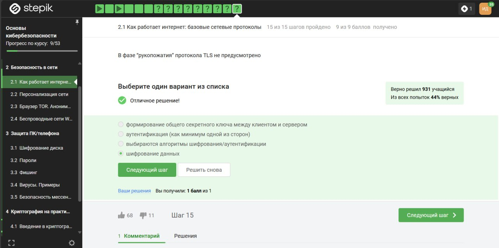
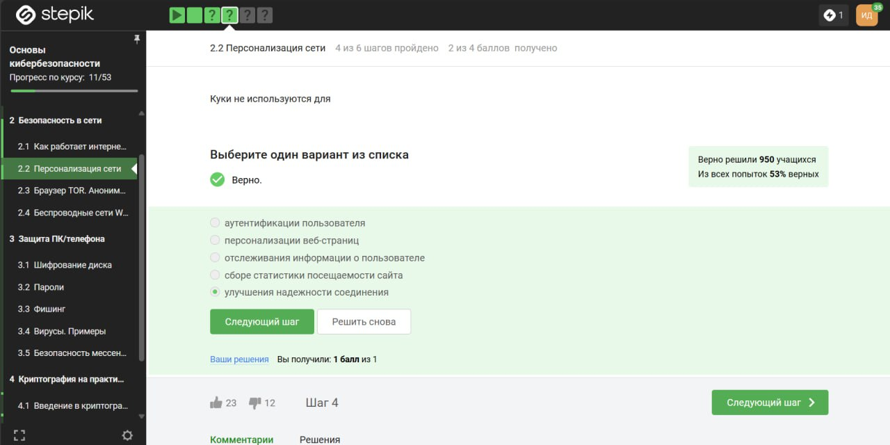
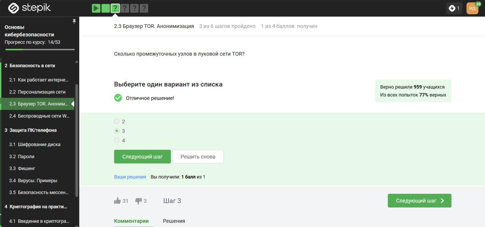

---
## Front matter
title: "Внешний курс. Блок 1: Безопасность в сети"
subtitle: "Дисциплина: Основы информационной безопасности"
author: "Ибатулина Дарья Эдуардовна, НКАбд-01-22"

## Generic otions
lang: ru-RU
toc-title: "Содержание"

## Bibliography
bibliography: bib/cite.bib
csl: pandoc/csl/gost-r-7-0-5-2008-numeric.csl

## Pdf output format
toc: true # Table of contents
toc-depth: 2
lof: true # List of figures
lot: true # List of tables
fontsize: 12pt
linestretch: 1.5
papersize: a4
documentclass: scrreprt
## I18n polyglossia
polyglossia-lang:
  name: russian
  options:
	- spelling=modern
	- babelshorthands=true
polyglossia-otherlangs:
  name: english
## I18n babel
babel-lang: russian
babel-otherlangs: english
## Fonts
mainfont: PT Serif
romanfont: PT Serif
sansfont: PT Sans
monofont: PT Mono
mainfontoptions: Ligatures=TeX
romanfontoptions: Ligatures=TeX
sansfontoptions: Ligatures=TeX,Scale=MatchLowercase
monofontoptions: Scale=MatchLowercase,Scale=0.9
## Biblatex
biblatex: true
biblio-style: "gost-numeric"
biblatexoptions:
  - parentracker=true
  - backend=biber
  - hyperref=auto
  - language=auto
  - autolang=other*
  - citestyle=gost-numeric
## Pandoc-crossref LaTeX customization
figureTitle: "Рис."
tableTitle: "Таблица"
listingTitle: "Листинг"
lofTitle: "Список иллюстраций"
lotTitle: "Список таблиц"
lolTitle: "Листинги"
## Misc options
indent: true
header-includes:
  - \usepackage{indentfirst}
  - \usepackage{float} # keep figures where there are in the text
  - \floatplacement{figure}{H} # keep figures where there are in the text
---

# Цель работы

Выполненить контрольные задания первого блока "Безопасность в сети" внешнего курса "Основы кибербезопасности".

# Выполнение заданий блока "Основы Кибербезопасности"

## Как работает интернет: базовые сетевые протоколы

Протокол HTTP(S) является примером протокола прикладного уровня, по которому передаются веб-страницы, поэтому ответ на вопрос 1 - HTTPS (рис. [-@fig:001]).

{#fig:001 width=70%}

На транспортном уровне существует два примера протокола: первый - это TCP, в честь которого названа модель. Этот протокол, в отличие от второго примера – UDP, обеспечивает надежную передачу пакетов. Ответ на вопрос - транспортный (рис. [-@fig:002]).

{#fig:002 width=70%}

Существуют две версии адресации в протоколе IP. Популярный на сегодняшний день - это версия 4 адресации (IPv4), и этот адрес состоит из большего набора чисел, нежели порт в TCP протоколе, а именно это 4 числа от 0 до 255. В других двух вариантах встречаются числа большие 255, что неверно для IPv4 (рис. [-@fig:003]).

{#fig:003 width=70%}

Основная задача DNS-сервера - это сопоставить название, то есть доменное имя, с корректным IP-адресом, с тем, где лежит этот сервер, этот сайт (рис. [-@fig:004]).

{#fig:004 width=70%}

Классификация протоколов в модели TCP/IP:

- Прикладной уровень (Application Layer): HTTP, RTSP, FTP, DNS.

- Транспортный уровень (Transport Layer): TCP, UDP, SCTP, DCCP.

- Сетевой (Межсетевой) уровень (Network Layer): IP.

- Уровень сетевого доступа (Канальный) (Link Layer): Ethernet, IEEE 802.11, WLAN, SLIP, Token Ring, ATM и MPLS (рис. [-@fig:005]).

{#fig:005 width=70%}

Протокол http передает не зашифрованные данные, а протокол https уже будет передавать зашифрованные данные (рис. [-@fig:006]).

{#fig:006 width=70%}

Во-первых, https передает зашифрованные данные, а следовательно, одна из фаз - передача данных, другая должна быть рукопожатием (рис. [-@fig:007]).

{#fig:007 width=70%}

TLS определяется и клиентом, и сервером, чтобы было возможно подключиться (рис. [-@fig:008]).

{#fig:008 width=70%}

В ходе TLS-рукопожатия клиент и сервер вместе выполняют следующие действия:

* Указывают, какую версию TLS (TLS 1.0, 1.2, 1.3 и т. д.) они будут использовать
* Решают, какие наборы шифров (см. ниже) они будут использовать
* Проверяют подлинность сервера с помощью открытого ключа сервера и цифровой подписи центра сертификации SSL.
* Генерируют сеансовые ключи, чтобы использовать симметричное шифрование после завершения рукопожатия
Следовательно, вариант *шифрование* выбираем, он лишний (рис. [-@fig:009]).

{#fig:009 width=70%}

## Персонализация сети

Куки, как правило, хранят в себе список параметров и их значений. Этими параметрами могут быть id пользователя, id сессии, иногда описан тип браузера и время запросов и некоторые действия пользователей (рис. [-@fig:010]).

{#fig:010 width=70%}

Куки не делают соединение более надежным (рис. [-@fig:011]).

{#fig:011 width=70%}

Конечно же, куки генерируются сервером (рис. [-@fig:012]).

{#fig:012 width=70%}

Куки бывают сессионные; как правило, эти cookies используются при навигации на сайте и удаляются при закрытии окна браузера  (рис. [-@fig:013]).

{#fig:013 width=70%}

## Браузер TOR. Анонимизация

В луковой модели маршрутизации у нас тоже есть узлы. Они разделяются на охранный узел, промежуточный и выходной. В браузере Tor всегда есть три роутера, их не больше и не меньше (рис. [-@fig:014]).

{#fig:014 width=70%}

IP-адрес не должен быть известен охранному и промежуточному узлам (рис. [-@fig:015]).

{#fig:015 width=70%}

Далее отправитель генерирует общие ключи с помощью определенного криптографического алгоритма, того же самого, который используется в TLS-протоколе. Он генерирует общие ключи последовательно с охранным узлом A, далее с промежуточным узлом B, а потом и с выходным узлом C (рис. [-@fig:016]).

{#fig:016 width=70%}

Для получения пакетов не нужно использовать TOR. TOR — это технология, которая позволяет с некоторым успехом скрыть личность человека в интернете. Ну и напоследок, наверное, стоит отметить, что, конечно, у браузера Tor есть как и поклонники, которые пользуются им, так и люди, которые считают, что такая версия анонимизации не очень хорошая по разным причинам, например, потому, что так можно общаться не только с хорошими людьми, но и с плохими. Тут уже каждый выбирает сам для себя, насколько это хорошая идея - иметь такую анонимную сеть или нет (рис. [-@fig:017]).

{#fig:017 width=70%}

## Беспроводные сети Wi-fi

WiFi - это технология беспроводной локальной сети, она основана на стандарте IEEE 802.11 (рис. [-@fig:018]).

{#fig:018 width=70%}

WiFi работает на самом нижнем канальном уровне (рис. [-@fig:019]).

{#fig:019 width=70%}

Самый ранний и на сегодняшний день небезопасный метод шифрования данных WiFi называется WEP. Он устарел и уже категорически не рекомендуется к использованию. Он устарел, в частности, потому, что использовал малую длину ключа: так, например, он использовал длину ключа в 40 бит, это довольно мало на сегодняшний день, он может быть легко взломан (рис. [-@fig:020]).

{#fig:020 width=70%}

Лектор говорит: Поговорим все-таки о безопасности в сетях WiFi. Что я имею в виду под безопасностью? Я имею в виду передачу данных от устройства, будь это мобильный телефон или компьютер, к роутеру, к тому прибору, который подключен непосредственно к глобальной сети Интернет с помощью провода, и безопасность осуществляется на этом уровне с помощью шифрования и аутентификации (рис. [-@fig:021]).

{#fig:021 width=70%}

Судя по названию, WPA2 Personal для личного использования, как раз для домашней сети, enterprise - для использования в коммерческих организациях (рис. [-@fig:022]).

{#fig:022 width=70%}

# Выводы

В результате выполнения блока "Безопасность в сети" я узнала, как работают базовые сетевые протоколы, куки-файлы, сети Wi-Fi и для чего предназначен браузер TOR.
