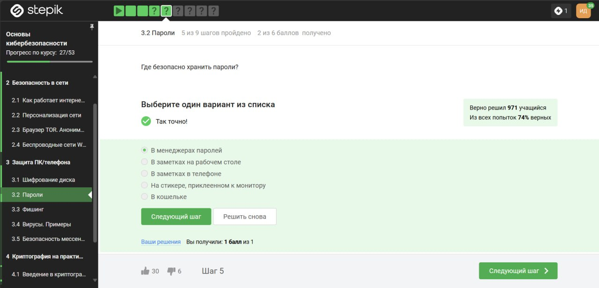
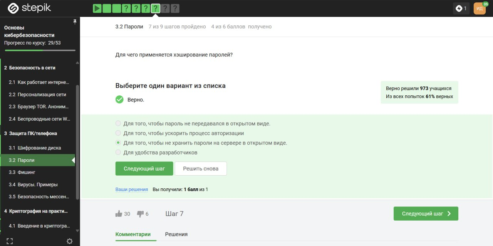
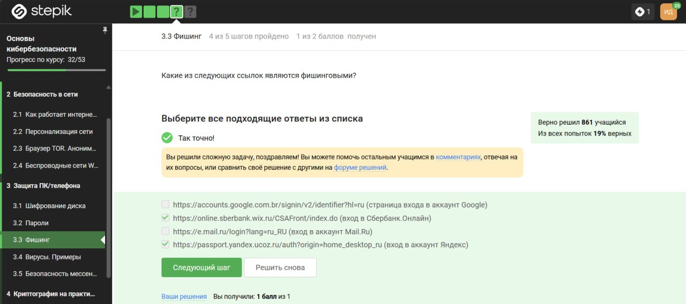

---
## Front matter
title: "Внешний курс. Блок 2: Защита ПК/Телефона"
subtitle: "Дисциплина: Основы информационной безопасности"
author: "Ибатулина Дарья Эдуардовна, НКАбд-01-22"
## Generic otions
lang: ru-RU
toc-title: "Содержание"

## Bibliography
bibliography: bib/cite.bib
csl: pandoc/csl/gost-r-7-0-5-2008-numeric.csl

## Pdf output format
toc: true # Table of contents
toc-depth: 2
lof: true # List of figures
lot: true # List of tables
fontsize: 12pt
linestretch: 1.5
papersize: a4
documentclass: scrreprt
## I18n polyglossia
polyglossia-lang:
  name: russian
  options:
	- spelling=modern
	- babelshorthands=true
polyglossia-otherlangs:
  name: english
## I18n babel
babel-lang: russian
babel-otherlangs: english
## Fonts
mainfont: PT Serif
romanfont: PT Serif
sansfont: PT Sans
monofont: PT Mono
mainfontoptions: Ligatures=TeX
romanfontoptions: Ligatures=TeX
sansfontoptions: Ligatures=TeX,Scale=MatchLowercase
monofontoptions: Scale=MatchLowercase,Scale=0.9
## Biblatex
biblatex: true
biblio-style: "gost-numeric"
biblatexoptions:
  - parentracker=true
  - backend=biber
  - hyperref=auto
  - language=auto
  - autolang=other*
  - citestyle=gost-numeric
## Pandoc-crossref LaTeX customization
figureTitle: "Рис."
tableTitle: "Таблица"
listingTitle: "Листинг"
lofTitle: "Список иллюстраций"
lotTitle: "Список таблиц"
lolTitle: "Листинги"
## Misc options
indent: true
header-includes:
  - \usepackage{indentfirst}
  - \usepackage{float} # keep figures where there are in the text
  - \floatplacement{figure}{H} # keep figures where there are in the text
---

# Цель работы

Пройти второй блок курса "Основы кибербезопасности", выполнить контрольные задания к блоку.

# Выполнение блока 2: Защита ПК/Телефона

## Шифрование диска

Шифровать можно не только жесткий диск, где мы храним файлы, можно шифровать и загрузочный сектор диска. И для этого есть алгоритмы шифрования. Ответ - можно (рис. [-@fig:001]).

{#fig:001 width=70%}

Шифрование диска основано на симметричном шифровании (рис. [-@fig:002]).

{#fig:002 width=70%}

Во всех популярных операционных системах есть встроенные утилиты, которые позволяют шифровать жесткий диск: для Windows этo Bitlocker, в Linux – LUKS, в MacOS – это FileVault. Кроме того, есть и сторонние опенсорсные (open source) программы, то есть бесплатные: это Veracrypt, PGPDisk, которые можно установить себе и использовать их для шифрования ваших жестких дисков, загрузочных секторов или флешек (рис. [-@fig:003]).

{#fig:003 width=70%}

## Пароли

Стойкий пароль должен состоять из цифр, букв нижнего регистра, верхнего регистра и спецсимволов. Как правило, при регистрации на каком-нибудь сайте или приложении вас просят добавить как минимум один спецсимвол, как минимум одну цифру, как минимум одну букву верхнего регистра, нижнего регистра. Это все сделано для того, чтобы сложность перебора вашего пароля была большой (рис. [-@fig:004]).

{#fig:004 width=70%}

Конечно же, безопасно хранить пароли только в менеджере паролей, но никак не в заметках телефона и на стикере монитора (рис. [-@fig:005]).

{#fig:005 width=70%}

Капча - это аббревиатура с английского; это тест для определения, является ли пользователь, который общается с веб-сервисом, человеком или компьютером, ботом, которой пытается просто-напросто перебрать все пароли (рис. [-@fig:006]).

{#fig:006 width=70%}

Хранить пароли в открытом виде очень опасно, поэтому хранят их хэши (рис. [-@fig:007]).

{#fig:007 width=70%}

Основная идея в защите слабых паролей - так называемая соль. Есть еще перец, про перец мы говорить не будем. Соль используется для того, чтобы увеличить стойкость пароля для пользователей, которые сами не догадались о стойкости своих паролей. Например, если у нас alice логинится с паролем 12345, что делает при этом сервер? Сервер не хочет хранить хэш от пароля 12345, потому что, скорее всего, злоумышленник имеет таблицы с самыми популярными паролями и их хэшами. Какая функция хэш используется в конкретном сервере, все знают. В основном, много серверов используют в своих таблицах SHA2 или SHA3, и, естественно, злоумышленник может для самых частых паролей посчитать эти значения, поэтому хранить хэш от 12345 абсолютно бессмысленно, и так понятно, что это соответствует паролю 12345 (рис. [-@fig:008]).

{#fig:008 width=70%}

нужно использовать длинные пароли с максимально большим алфавитом, хранить их стоит в менеджерах паролей, пароли нужно менять достаточно регулярно, особенно к таким критическим сервисам, как почта. Политика (особенно больших компаний) по безопасности состоит в том, что пароли нужно менять. И для разных сайтов, и для разных программ нужно использовать разные пароли, поскольку компрометация одного из них может вести к компрометации всех остальных, если вы используете одинаковые пароли. И напоследок, есть такой сервис для проверки, утёк ли ваш пароль где-либо: он называется haveibeenpwned.com. Вы можете зайти на этот сайт, забить какой-то свой аккаунт и проверить, засветились ваши данные в базах данных серверов, ключи к которым утекли (рис. [-@fig:009]).

{#fig:009 width=70%}

## Фишинг

пример фишинга - эта маскировка под известные веб-сайты только с другим доменным именем, начало может быть одинаковое или середина (рис. [-@fig:010]).

{#fig:010 width=70%}

Может фишинговое письмо прийти и от друга, знакомого или родственника, если его взломали (рис. [-@fig:011]).

{#fig:011 width=70%}

## Вирусы. Примеры

Спуфинг - это подмена адреса отправителя в имейлах (рис. [-@fig:012]).

{#fig:012 width=70%}

Троян маскируется под обыкновенную безобидную программу, при запуске которой вирус легко проникает в ваш компьютер и поражает его (рис. [-@fig:013]).

{#fig:013 width=70%}

## Безопасность мессенджеров

При генерации первого сообщения отправителем формируется ключ шифрования (рис. [-@fig:014]).

{#fig:014 width=70%}

Суть довольно простая: у нас есть два участника - Алиса и Боб, A и B, и сквозное шифрование заключается в том, что сервер, который передает сообщение, который направляет сообщение от Алисы к Бобу или от Бобу к Алисе, знает только то, куда эти сообщения должны быть направлены, но сообщения он передает в зашифрованном виде, то есть он как бы работает маршрутизатором  сообщений, не зная о том, что он передает. Что происходит, если мы хотим отправить сообщение от Алисы к Бобу? Алиса шифрует свои данные, кладет на сервере шифр-текст с пометкой, что этот шифр-текст предназначен для Боба. Когда Боб заходит в сеть, сервер видит: «Ага, Боб зашел в сеть, надо обновить его сообщение», и отправляет шифр-текст от Алисы. Боб получает этот шифр-текст, дешифрует его, получает сообщение в открытом виде. При этом сервер не знает ни ключ, с помощью которого Алиса шифровала, ни тем более сообщение в открытом виде. То есть, сообщения передаются по узлам связи в зашифрованном виде (рис. [-@fig:015]).

{#fig:015 width=70%}

# Выводы

Мною был пройден второй блок курса "Основы кибербезопасности". В результате я повторила правила составления и хранения паролей, узнала много нового  о вирусах и мерах безопасности против них.
