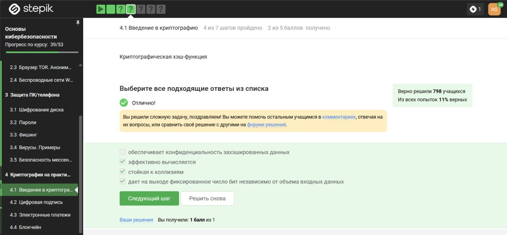

---
## Front matter
title: "Внешний курс. Блок 3: Криптография на практике"
subtitle: "Дисциплина: Основы информационной безопасности"
author: "Ибатулина Дарья Эдуардовна, НКАбд-01-22"

## Generic otions
lang: ru-RU
toc-title: "Содержание"

## Bibliography
bibliography: bib/cite.bib
csl: pandoc/csl/gost-r-7-0-5-2008-numeric.csl

## Pdf output format
toc: true # Table of contents
toc-depth: 2
lof: true # List of figures
lot: true # List of tables
fontsize: 12pt
linestretch: 1.5
papersize: a4
documentclass: scrreprt
## I18n polyglossia
polyglossia-lang:
  name: russian
  options:
	- spelling=modern
	- babelshorthands=true
polyglossia-otherlangs:
  name: english
## I18n babel
babel-lang: russian
babel-otherlangs: english
## Fonts
mainfont: PT Serif
romanfont: PT Serif
sansfont: PT Sans
monofont: PT Mono
mainfontoptions: Ligatures=TeX
romanfontoptions: Ligatures=TeX
sansfontoptions: Ligatures=TeX,Scale=MatchLowercase
monofontoptions: Scale=MatchLowercase,Scale=0.9
## Biblatex
biblatex: true
biblio-style: "gost-numeric"
biblatexoptions:
  - parentracker=true
  - backend=biber
  - hyperref=auto
  - language=auto
  - autolang=other*
  - citestyle=gost-numeric
## Pandoc-crossref LaTeX customization
figureTitle: "Рис."
tableTitle: "Таблица"
listingTitle: "Листинг"
lofTitle: "Список иллюстраций"
lotTitle: "Список таблиц"
lolTitle: "Листинги"
## Misc options
indent: true
header-includes:
  - \usepackage{indentfirst}
  - \usepackage{float} # keep figures where there are in the text
  - \floatplacement{figure}{H} # keep figures where there are in the text
---

# Цель работы

Пройти третий блок курса "Основы кибербезопасности", выполнить тестовые задания к нему.

# Выполнение блока 3: Криптография на практике

## Введение в криптографию
 
В асимметричной криптографии (её еще называют криптографией с открытым ключом) у каждой из сторон есть пара ключей: открытый ключ и секретный ключ (рис. [-@fig:001]).

{#fig:001 width=70%}

Важное свойство криптографической хэш-функций, то, что делает её криптографической – это стойкость к коллизиям. Криптографическая хэш-функция берет на вход произвольный объем данных, то есть какие-то биты и выдает на выходе фиксированную строку, например длины n. Важно, что, как правило, функция сжимает данные: она берет большой набор данных и выдаёт потом маленькое фиксированное значение. Кроме того, криптографическая хэш-функция эффективно вычисляется (рис. [-@fig:002]).

{#fig:002 width=70%}

Отмечены алгоритмы цифровой подписи (рис. [-@fig:003]).

{#fig:003 width=70%}

К шифротексту, который мы сгенерировали с помощью ключа для какого-то сообщения, мы еще добавляем код аутентификации сообщения. Это также симметричный примитив, который берет на вход какой-то ключ (это должен быть другой ключ, не тот, с которого мы шифровали) и сообщение и выдает код аутентификации сообщения (рис. [-@fig:004])

{#fig:004 width=70%}

Использую определение обмена ключами Диффи-Хэллмана для ответа на данный вопрос (рис. [-@fig:005]).

{#fig:005 width=70%}

## Цифровая подпись

По определению цифровой подписи протокол ЭЦП относится к протоколам с публичным ключом (рис. [-@fig:006]).

{#fig:006 width=70%}

Rаждая машина запускает процедуру Verify, которая берет на вход само обновление, подпись и открытый ключ разработчика (рис. [-@fig:007]).

{#fig:007 width=70%}

цифровая подпись предназначена, во-первых, для обеспечения целостности сообщения, иными словами, если сообщение в процессе передачи было изменено, то подпись этого измененного сообщения будет проверена некорректно, то есть при проверке корректности подписи мы узнаем о том, что сообщение было изменено. Во-вторых, цифровая подпись обеспечивает аутентификацию сообщения, то есть мы можем установить принадлежность подписи владельцу, иными словами, никто другой не смог бы поставить такую подпись под этим сообщением. Ну и последнее, третье – это неотказ от авторства, то есть как только подпись подписана, подписавший её человек не может отказаться от того факта, что он ее подписал. Конечно, в случае кражи секретного ключа, с помощью которого подписывается сообщение, формируется подпись, о корректной безопасности цифровой подписи никакой речи быть не может, поскольку секретный ключ украден. Поэтому, электронная подпись не обеспечивает конфиденциальности (рис. [-@fig:008]).

{#fig:008 width=70%}

Что касается усиленной квалифицированной подписи, эта подпись уже имеет юридическую силу, она, как правило, равнозначна рукописной. Для того, чтобы получить такую подпись, вам нужно пойти со своим паспортом и с другими данными в сертификационный центр, который должен быть аккредитован конкретным министерством. Такие подписи используются на Госуслугах, в государственном документообороте. Для отправки налоговой отчетности в ФНС используется усиленная квалифицированная электронная подпись (рис. [-@fig:009]).

{#fig:009 width=70%}

Сертификат подписывается с помощью электронной подписи уже доверенной стороной, удостоверяющим центром, тем центром, который имеет лицензию министерства (рис. [-@fig:010]).

{#fig:010 width=70%}

## Электронные платежи

На данный момент существуют такие платежные системы, как: Visa, MasterCard, МИР (рис. [-@fig:011]).

{#fig:011 width=70%}

 Основные категории вещей, которые мы можем доказать: 1) то, что я знаю – это либо пароль, либо PIN-код, либо в случае онлайн-платежей это секретный код, 2) конкретно в онлайн-платежах мы еще используем второй фактор – это то, чем я владею, например, телефон, именно поэтому нам часто приходит код, который вы должны подтвердить или вбить в ваш браузер, 3) другой фактор аутентификации – это свойства, например, биометрия, опечаток пальца, сетчатки глаза, 4) четвертый фактор аутентификации – локация (рис. [-@fig:012]).

{#fig:012 width=70%}

При онлайн платежах используется многофакторная аутентификация банком-эмитентом (выпустившим карту), чтобы удостовериться, что транзакцию совершает именно владелец карты или счета, а не злоумышленник (рис. [-@fig:013]).

{#fig:013 width=70%}

## Блокчейн

Proof-of-Work, или PoW, (доказательство выполнения работы) — это алгоритм достижения консенсуса в блокчейне; он используется для подтверждения транзакций и создания новых блоков. С помощью PoW майнеры конкурируют друг с другом за завершение транзакций в сети и за вознаграждение.
Пользователи сети отправляют друг другу цифровые токены, после чего все транзакции собираются в блоки и записываются в распределенный реестр, то есть в блокчейн. Следовательно, в доказательстве работы криптографической хэш-функции используется такое ее свойство, как сложность нахождения прообраза (рис. [-@fig:014]).

{#fig:014 width=70%}

В основе любого блокчейна, в частности биткоина, лежит консенсус – соглашение, в терминах криптовалют консенсус - это некая публичная структура данных или ledger (переводится с английского как «бухгалтерская книга»), где просто содержится история всех переводов, хранится список того, кто что кому заплатил, в какое время. Почему консенсус? Потому что эта публичная структура, и бухгалтерский учет должен обеспечивать четыре основных свойства. Первое - это постоянство, то есть когда-либо добавленНые данные не должны быть удалены из этой структуры. Второе - это сам консенсус, то есть все участники видят одни и те же данные и соглашаются с одним и теми же данными, исключением могут быть последние пары блоков, то есть последние изменения в этом блокчейне, в этой публичной структуре данных. Третье - это живучесть, это означает, что мы можем добавлять новые транзакции, когда хотим, мы можем осуществлять платежи, когда хотим. И последнее четвертое свойство - это открытость, то есть любой человек может быть участником блокчейна. Это справедливо не для всех блокчейнов, для биткоина это справедливо. Значит, выбираем все 4 свойства (рис. [-@fig:015]).

{#fig:015 width=70%}

Допустим, у нас вами есть в блокчейне 3 участника, которые обмениваются друг с другом транзакциями. Важно то, что у каждого участника есть свой секретный ключ, и своим секретным ключом мы всегда будем подтверждать какую-то транзакцию. Важно то, что этот ключ у нас секретный, мы его используем для подписи. Подпись – это и есть подтверждение моей транзакции. Мы с вами разбирали в одной из лекций, как работает электронная цифровая подпись, у этого примитива есть секретный и открытый ключи, и наш секретный ключ - это то, что позволяет нам совершать транзакции от нашего лица. Тогда ответ - цифровая подпись (рис. [-@fig:016]).

{#fig:016 width=70%}

# Выводы

Я прошла третий блок курса, узнала много нового о криптографии, цифровых подписях и технологии блокчейн, а также освежила в памяти знания о том, как работают переводы криптовалюты с точки зрения безопасности транзакций.
