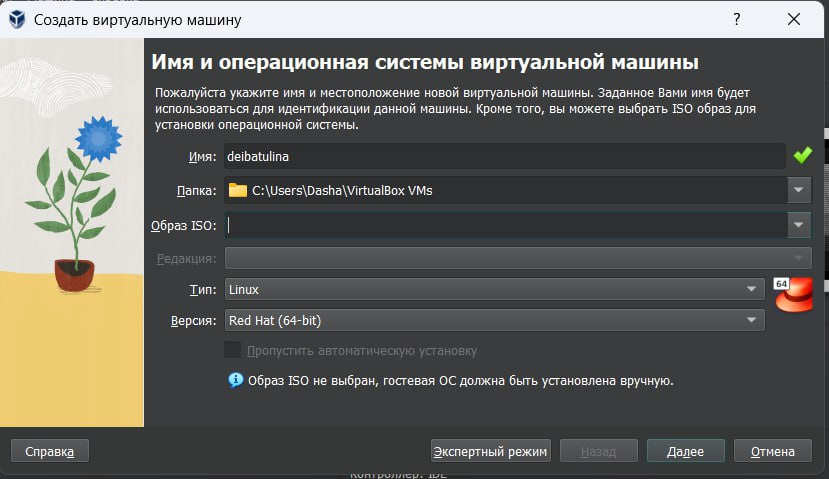
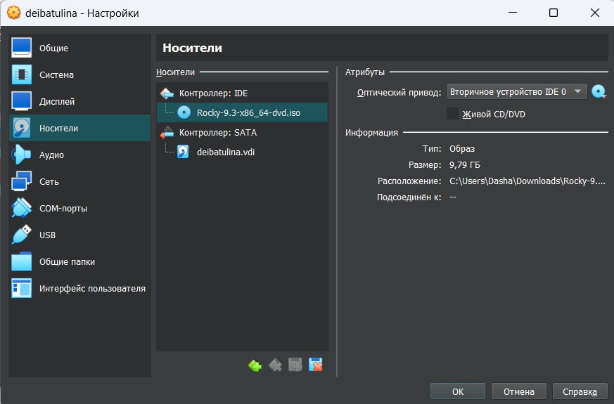
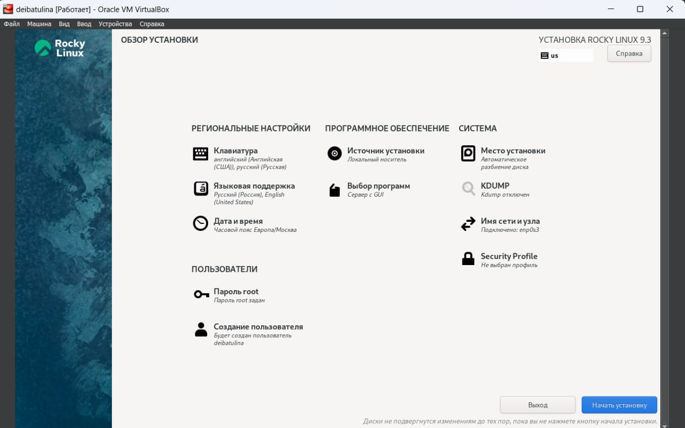
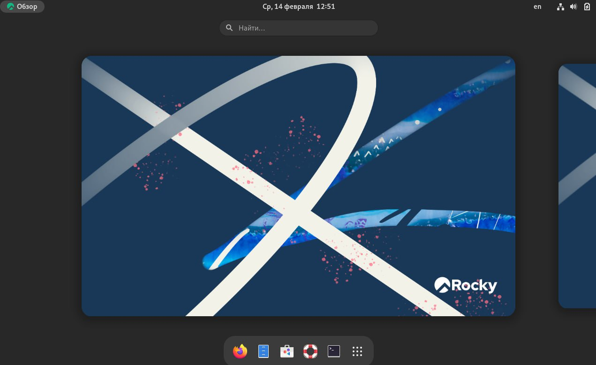

---
## Front matter
lang: ru-RU
title: Презентация по лабораторной работе №1
subtitle: Установка и конфигурация операционной системы на виртуальную машину
author:
  - Ибатулина Д.Э.
institute:
  - Российский университет дружбы народов, Москва, Россия
date: 16 февраля 2024

## i18n babel
babel-lang: russian
babel-otherlangs: english

## Formatting pdf
toc: false
toc-title: Содержание
slide_level: 2
aspectratio: 169
section-titles: true
theme: metropolis
header-includes:
 - \metroset{progressbar=frametitle,sectionpage=progressbar,numbering=fraction}
 - '\makeatletter'
 - '\beamer@ignorenonframefalse'
 - '\makeatother'
---

# Информация

## Докладчик

:::::::::::::: {.columns align=center}
::: {.column width="70%"}

  * Ибатулина Дарья Эдуардовна
  * студентка группы НКАбд-01-22
  * факультет физико-математических и естественных наук
  * Российский университет дружбы народов
  * [deibatulina.github.io](mailto:1132226434@pfur.ru)
  * <https://github.com/deibatulina>

:::
::: {.column width="30%"}

:::
::::::::::::::

# Вводная часть

## Актуальность

Навык установки операционных систем на виртуальную машину является очень востребованным и полезным в работе.

## Объект и предмет исследования

Дистрибутив Linux Rocky, основные команды для работы.

## Цели и задачи

1. Установить ОС Linux Rocky на виртуальную машину;
2. Произвести минимальную настройку системы;
3. Выполнить задания;
4. Ответить на контрольные вопросы.

## Материалы и методы

- Процессор `pandoc` для входного формата Markdown
- Результирующие форматы
	- `pdf`
	- `html`
- Автоматизация процесса создания: `Makefile`

# Элементы презентации

## Содержание исследования

Создаём новую виртуальную машину, дадим ей имя, папку, тип и версию ОС.

## Подключение образа диска

Подключаем образ диска.

## Проверка параметров системы

После того, как настроили систему, проверяем, всё ли верно.

## Интерфейс Linux Rocky

Вот так выглядит интерфейс Linux Rocky.

## Результаты

* Попрактиковалась в установке ОС на виртуальную машину;
* Вспомнила основные команды Linux;
* Попрактиковалась в создании и компиляции шаблонов в формате markdown.

## Итоговый слайд

Выполнение данной лабораторной работы не было очень сложным, поскольку в прошлом году я уже устанавливала дистрибутив Fedora Linux на виртуальную машину. Вспомнить команды терминала и поработать в markdown было очень полезно и познавательно для меня.

