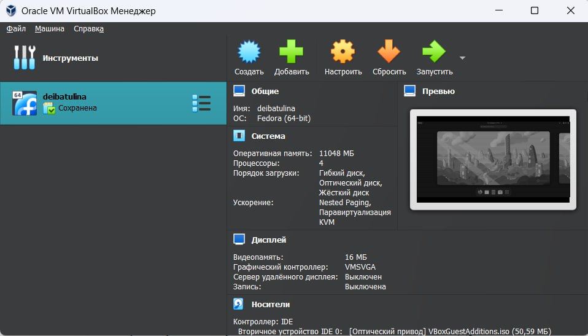

---
## Front matter
title: "Лабораторная работа №1"
subtitle: "Установка и конфигурация операционной системы на виртуальную машину"
author: "Дарья Эдуардовна Ибатулина"

## Generic otions
lang: ru-RU
toc-title: "Содержание"

## Bibliography
bibliography: bib/cite.bib
csl: pandoc/csl/gost-r-7-0-5-2008-numeric.csl

## Pdf output format
toc: true # Table of contents
toc-depth: 2
lof: true # List of figures
lot: true # List of tables
fontsize: 12pt
linestretch: 1.5
papersize: a4
documentclass: scrreprt
## I18n polyglossia
polyglossia-lang:
  name: russian
  options:
	- spelling=modern
	- babelshorthands=true
polyglossia-otherlangs:
  name: english
## I18n babel
babel-lang: russian
babel-otherlangs: english
## Fonts
mainfont: PT Serif
romanfont: PT Serif
sansfont: PT Sans
monofont: PT Mono
mainfontoptions: Ligatures=TeX
romanfontoptions: Ligatures=TeX
sansfontoptions: Ligatures=TeX,Scale=MatchLowercase
monofontoptions: Scale=MatchLowercase,Scale=0.9
## Biblatex
biblatex: true
biblio-style: "gost-numeric"
biblatexoptions:
  - parentracker=true
  - backend=biber
  - hyperref=auto
  - language=auto
  - autolang=other*
  - citestyle=gost-numeric
## Pandoc-crossref LaTeX customization
figureTitle: "Рис."
tableTitle: "Таблица"
listingTitle: "Листинг"
lofTitle: "Список иллюстраций"
lotTitle: "Список таблиц"
lolTitle: "Листинги"
## Misc options
indent: true
header-includes:
  - \usepackage{indentfirst}
  - \usepackage{float} # keep figures where there are in the text
  - \floatplacement{figure}{H} # keep figures where there are in the text
---

# Цель работы

Целью данной работы является приобретение практических навыков установки операционной системы на виртуальную машину, настройки минимально необходимых для дальнейшей работы сервисов.

# Задание

Установить на виртуальную машину VirtualBox дистрибутив Linux Rocky.

# Теоретическое введение

В данном разделе я представляю краткое определение понятия *виртуальные машины* и рассказываю о том, то такое Rocky Linux.

Rocky Linux — дистрибутив Linux, разработанный Rocky Enterprise Software Foundation. Предполагается, что это будет полный бинарно-совместимый выпуск, использующий исходный код операционной системы Red Hat  Enterprise Linux (RHEL). Цель проекта — предоставить корпоративную операционную систему производственного уровня, поддерживаемую сообществом. Rocky Linux, наряду с Red Hat Enterprise Linux и SUSE Linux Enterprise, стала популярной для использования в корпоративных операционных системах.

Виртуальные машины (ВМ) — это такие абстрактные вычислительные экземпляры, созданные программой, работающей на другой машине, и которые физически не существуют, но работают, как настоящий компьютер. ВМ работает на программном обеспечении, а не на оборудовании. Так сказать, программное обеспечение создаёт «воображаемый» компьютер, который ведёт себя как физический. Другими словами, пользователь создаёт компьютер внутри другого компьютера. Несколько ВМ могут работать параллельно на одном базовом устройстве отдельно друг от друга.

# Выполнение лабораторной работы

Для начала переходим на официальный сайт Linux Rocky и устанавливаем образ операционной системы на компьютер (рис. [-@fig:001]).

{#fig:001 width=70%}

Для выполнения лабораторной работы понадобится VirtualBox. В программе можно создавать виртуальные машины. Она осталась у меня с прошлого года (рис. [-@fig:002]).
    
{#fig:002 width=70%}

Теперь выбираем папку для виртуальных машин. Поскольку я выполняю работу на своей технике, то и каталог могу выбрать на своё усмотрение (рис. [-@fig:003]).
    
{#fig:003 width=70%}

Создаём новую машину. Даём ей имя (как логин в дисплейном классе по соглашению об именовании), выбираем папку для виртуальной машины, тип и версию ОС (рис. [-@fig:004]).
    
{#fig:004 width=70%}

Выбираем объём основной памяти и число процессоров (я выбрала почти максимально возможные значения, чтобы вирутальная машина не тормозила, и с ней было легко и комфортно работать) (рис. [-@fig:005]).
    
{#fig:005 width=70%}

Затем создаём новый виртуальный жёсткий диск и задаём его размер (рис. [-@fig:006]).
    
{#fig:006 width=70%}

В пункте "Носители" выбираем нужный нам образ диска (это тот, что я скачала в самом начале работы) (рис. [-@fig:007]).
    
{#fig:007 width=70%}

Запускается процесс установки Linux Rocky (рис. [-@fig:008]).
    
{#fig:008 width=70%}

Теперь выбираем язык, который будет использоваться в процессе установки (Русский) (рис. [-@fig:009]).
    
{#fig:009 width=70%}

Отключаем kdump (рис. [-@fig:010]).
    
{#fig:010 width=70%}

Далее выбираем программы (Development Tools/Средства разработки) и в графе "Базовое окружение" выбираем "Сервер с GUI" (рис. [-@fig:011]).
    
{#fig:011 width=70%}

Задаём пароль root-администратора (рис. [-@fig:012]).
    
{#fig:012 width=70%}

Выберем устройства для установки операционной системы (рис. [-@fig:013]).
    
{#fig:013 width=70%}

Настраиваем сеть и даём имя узлу в формате user.localdomain (где user - это логин в дисплейном классе) (рис. [-@fig:014]).
    
{#fig:014 width=70%}

Далее проверяем, все ли параметры установлены так, как прописано в руководстве к выполнению лабораторной работы (рис. [-@fig:015]).
    
{#fig:015 width=70%}

Затем появляется окно с установкой. И видим, что система установлена (рис. [-@fig:016]).
    
{#fig:016 width=70%}

Перезагружаем систему и видим интерфейс Linux Rocky. Очень похож на Fedora, в которой мы работали в прошлом году (рис. [-@fig:017]).
    
{#fig:017 width=70%}

Подключаем образ диска дополнений гостевой ОС (рис. [-@fig:018]).
    
{#fig:018 width=70%}

Приступаем к выполнению заданий лабораторной работы:
    
Дождитесь загрузки графического окружения и откройте терминал. В окне терминала проанализируйте последовательность загрузки системы, выполнив команду dmesg. Можно просто просмотреть вывод этой команды (рис. [-@fig:019]).
    
{#fig:019 width=70%}

Получим следующую информацию (используя grep для поиска определённой информации):
1. Версия ядра Linux (Linux version) (рис. [-@fig:020]).
    
{#fig:020 width=70%}

2. Частота процессора (Detected Mhz processor) (рис. [-@fig:021]).
    
{#fig:021 width=70%}

3. Модель процессора (CPU0) (рис. [-@fig:022]).
    
{#fig:022 width=70%}

4. Объем доступной оперативной памяти (Memory available) (рис. [-@fig:023]).
    
{#fig:023 width=70%}

5. Тип обнаруженного гипервизора (Hypervisor detected) (рис. [-@fig:024]).
    
{#fig:024 width=70%}

6. Тип файловой системы корневого раздела (рис. [-@fig:025]).
    
{#fig:025 width=70%}

7. Последовательность монтирования файловых систем (рис. [-@fig:026]).
    
.jpg){#fig:026 width=70%}

# Выводы

В данной лабораторной работе я попрактивовалась в установке операционной системы Linux Rocky на виртуальную машину, настроила необходимые для работы сервисы и выполнила задания (познакомилась с командой dmesg и той информацией об операционной системе, которую можно получить с помощью данной команды).

# Ответы на контрольные вопросы

1. Какую информацию содержит учётная запись пользователя?

Учетная запись пользователя содержит информацию по авторизации - учётные данные. Это идентификатор для подключения к системе. То есть, это:

Системное имя - должно быть уникальным, содержит только латинские знаки. Уникальный идентификатор пользователя в системе, содержит число. Полное имя - ФИО пользователя.

2. Укажите команды терминала и приведите примеры:
– для получения справки по команде (help);
– для перемещения по файловой системе (cd);
– для просмотра содержимого каталога (ls);
– для определения объёма каталога (du + имя каталога);
– для создания / удаления каталогов / файлов (rm - для удаления файлов, rmdir - для удаления каталогов, mkdir - для создания каталогов, touch - для создания файлов);
– для задания определённых прав на файл / каталог (chmod);
– для просмотра истории команд (history).
3. Что такое файловая система? Приведите примеры с краткой характеристикой.

Это способ хранения, организации и именования данных на различных носителях.

Примеры:

FAT32 - файловая система, в которой пространство разделено на три части: область служебных структур, указатели в виде таблиц и область хранения файлов;
ext4 - система, которая используется в основном в ОС на Linux. Журналируемая файловая система, в послдней версии максимальный размер файла - 16Гб.

4. Как посмотреть, какие файловые системы подмонтированы в ОС?

Для этого нужно ввести в терминал команду df - это покажет список всех файловых систем по номерам устройств, размеры и данные о памяти. Но при этом можно посмотреть в свойствах папок все эти данные вручную.

5. Как удалить зависший процесс?

* Команда `killall` - остановит все процессы, которые есть в данный момент.
* Команда `kill + id-процесса` поможет удалить один конкретный процесс. (Чтобы узнать id нужно написать в терминале команду `ps`).

# Список литературы{.unnumbered}

1. Руководство к лабораторной работе №1 "Установка и конфигурация операционной системы на виртуальную машину", Д.С. Кулябов, А.В. Королькова, М.Н. Геворкян.

::: {#refs}
:::
