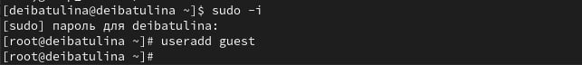
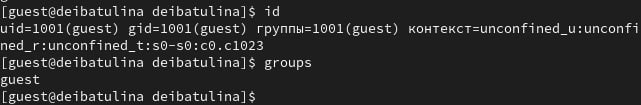
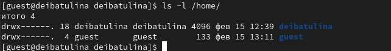
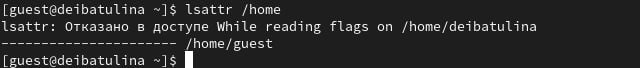
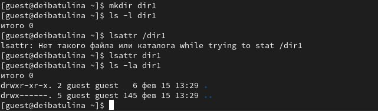
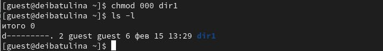
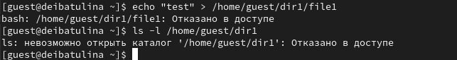

---
## Front matter
lang: ru-RU
title: Презентация по лабораторной работе №2
subtitle: Дискреционное разграничение прав в Linux. Основные атрибуты
author:
  - Ибатулина Д.Э.
institute:
  - Российский университет дружбы народов, Москва, Россия
date: 29 февраля 2024

## i18n babel
babel-lang: russian
babel-otherlangs: english

## Formatting pdf
toc: false
toc-title: Содержание
slide_level: 2
aspectratio: 169
section-titles: true
theme: metropolis
header-includes:
 - \metroset{progressbar=frametitle,sectionpage=progressbar,numbering=fraction}
 - '\makeatletter'
 - '\beamer@ignorenonframefalse'
 - '\makeatother'
---

# Информация

## Докладчик

:::::::::::::: {.columns align=center}
::: {.column width="70%"}

  * Ибатулина Дарья Эдуардовна
  * студентка группы НКАбд-01-22
  * факультет физико-математических и естественных наук
  * Российский университет дружбы народов
  * [deibatulina.github.io](mailto:1132226434@pfur.ru)
  * <https://github.com/deibatulina>

:::
::: {.column width="30%"}

:::
::::::::::::::

# Вводная часть

## Актуальность

Навыки работы с атрибутами (их установка и снятие), а также установки и ограничения прав доступа в ОС - неотъемлемое умение специалиста по информационной безопасности.

## Цели и задачи

1. Выполнить задания к лабораторной работе.
2. Заполнить две таблички: Установленные права и разрешённые действия и Минимальные права для совершения операций.
3. Сделать выводы по выполнении лабораторной работы.

# Элементы презентации

## Создание нового пользователя

Переключившись на учётную запись администратора, создадим нового пользователя.

## Уточнение имени пользователя, его группы, и групп, в которые он входит

Уточним имя пользователя, его группу и группы, в которые он входит.

## Определение существующих в системе директорий

Определим существующие в системе директории. Проверим, какие права на них установлены.

## Проверка установленных расширенных атрибутов

Проверьте, какие расширенные атрибуты установлены на поддиректориях, находящихся в директории */home*.

## Определение прав и установленных на новую директорию расширенных атрибутов

Определим права и установленные на новую директорию расширенные атрибуты.

## Снятие установленных расширенных атрибутов

Снимем расширенные атрибуты с новой директории.

## Получение сообщения об ошибке

Попытавшись создать в новой директории файл, я получила сообщение об ошибке: Отказано в доступе.

## Результаты

* попрактиковалась в установке и снятии расширенных атрибутов директорий;
* повторила установление прав доступа в ОС Linux.

