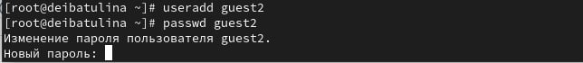
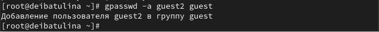
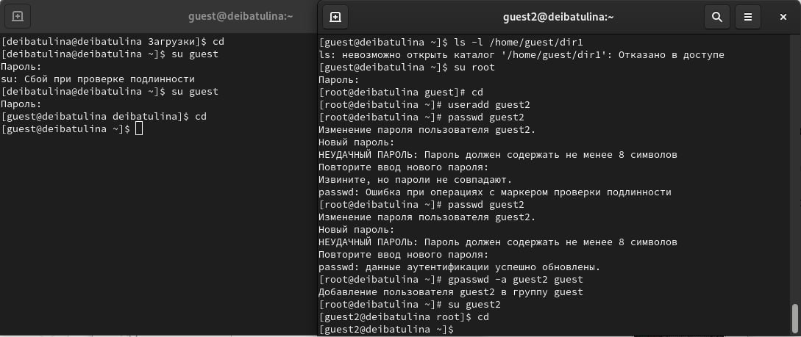

---
## Front matter
lang: ru-RU
title: Презентация по лабораторной работе №3
subtitle: Дискреционное разграничение прав в Linux. Два пользователя
author:
  - Ибатулина Д.Э.
institute:
  - Российский университет дружбы народов, Москва, Россия
date: 13 марта 2024

## i18n babel
babel-lang: russian
babel-otherlangs: english

## Formatting pdf
toc: false
toc-title: Содержание
slide_level: 2
aspectratio: 169
section-titles: true
theme: metropolis
header-includes:
 - \metroset{progressbar=frametitle,sectionpage=progressbar,numbering=fraction}
 - '\makeatletter'
 - '\beamer@ignorenonframefalse'
 - '\makeatother'
---

# Информация

## Докладчик

:::::::::::::: {.columns align=center}
::: {.column width="70%"}

  * Ибатулина Дарья Эдуардовна
  * студентка группы НКАбд-01-22
  * факультет физико-математических и естественных наук
  * Российский университет дружбы народов
  * [deibatulina.github.io](mailto:1132226434@pfur.ru)
  * <https://github.com/deibatulina>

:::
::: {.column width="30%"}

:::
::::::::::::::

# Вводная часть

## Актуальность

Навыки работы с атрибутами (их установка и снятие), создание нескольких учётных записей пользователя, а также навык установки и ограничения прав доступа в ОС - неотъемлемое умение специалиста по информационной безопасности.

## Цели и задачи

1. Выполнить задания к лабораторной работе.
2. Заполнить две таблички: *Установленные права и разрешённые действия для групп* и *Минимальные права для совершения операций от имени пользователей входящих в группу*.
3. Сделать выводы по выполнении лабораторной работы.

# Элементы презентации

## Создание нового пользователя

Переключившись на учётную запись администратора, создадим ещё одного нового пользователя *guest2*.

## Добавление пользователя в группу

Добавим в группу *guest* только что созданного мною пользователя.

## Вход в систему от двух пользователей

Войдём в систему на двух разных консолях от имени пользователей *guest* и *guest2*.

## Уточнение, в какие группы входит пользователь

Получаем информацию о том, в какие группы входит пользователь.

## Создание новой группы

Создаём новую группу.

## Разрешение всех действий в директории для пользователей группы

Установим все необходимые права на директорию для всех пользователей группы.

## Снятие всех атрибутов с директории

Снимем все атрибуты с директории.

## Результаты

* попрактиковалась в установке и снятии расширенных атрибутов директорий;
* повторила установление прав доступа в ОС Linux;
* получила практические навыки работы в консоли с атрибутами файлов для групп пользователей.

