---
## Front matter
title: "Отчёт по лабораторной работе №3"
subtitle: "Дискреционное разграничение прав в Linux. Два пользователя"
author: "Дарья Эдуардовна Ибатулина"

## Generic otions
lang: ru-RU
toc-title: "Содержание"

## Bibliography
bibliography: bib/cite.bib
csl: pandoc/csl/gost-r-7-0-5-2008-numeric.csl

## Pdf output format
toc: true # Table of contents
toc-depth: 2
lof: true # List of figures
lot: true # List of tables
fontsize: 12pt
linestretch: 1.5
papersize: a4
documentclass: scrreprt
## I18n polyglossia
polyglossia-lang:
  name: russian
  options:
	- spelling=modern
	- babelshorthands=true
polyglossia-otherlangs:
  name: english
## I18n babel
babel-lang: russian
babel-otherlangs: english
## Fonts
mainfont: PT Serif
romanfont: PT Serif
sansfont: PT Sans
monofont: PT Mono
mainfontoptions: Ligatures=TeX
romanfontoptions: Ligatures=TeX
sansfontoptions: Ligatures=TeX,Scale=MatchLowercase
monofontoptions: Scale=MatchLowercase,Scale=0.9
## Biblatex
biblatex: true
biblio-style: "gost-numeric"
biblatexoptions:
  - parentracker=true
  - backend=biber
  - hyperref=auto
  - language=auto
  - autolang=other*
  - citestyle=gost-numeric
## Pandoc-crossref LaTeX customization
figureTitle: "Рис."
tableTitle: "Таблица"
listingTitle: "Листинг"
lofTitle: "Список иллюстраций"
lotTitle: "Список таблиц"
lolTitle: "Листинги"
## Misc options
indent: true
header-includes:
  - \usepackage{indentfirst}
  - \usepackage{float} # keep figures where there are in the text
  - \floatplacement{figure}{H} # keep figures where there are in the text
---

# Цель работы

Получение практических навыков работы в консоли с атрибутами файлов для групп пользователей.

# Задание

1. Создание нового пользователя;
2. Добавление его в группу;
3. Уточнение имени пользователя, проверка того, в какие группы он входит;
4. Регистрация нового пользователя в группе;
5. Изменение прав директории;
6. Заполнение таблиц: "Установленные права и разрешённые действия для групп" и "Минимальные права для совершения операций от имени пользователей входящих в группу".

# Теоретическое введение

Права доступа определяют, какие действия конкретный пользователь может или не может совершать с определенным файлами и каталогами. С помощью разрешений можно создать надежную среду — такую, в которой никто не может поменять содержимое ваших документов или повредить системные файлы.

Группы пользователей Linux кроме стандартных root и users, здесь есть еще пару десятков групп. Это группы, созданные программами, для управления доступом этих программ к общим ресурсам. Каждая группа разрешает чтение или запись определенного файла или каталога системы, тем самым регулируя полномочия пользователя, а следовательно, и процесса, запущенного от этого пользователя. Здесь можно считать, что пользователь - это одно и то же что процесс, потому что у процесса все полномочия пользователя, от которого он запущен.

* daemon - от имени этой группы и пользователя daemon запускаютcя сервисы, которым необходима возможность записи файлов на диск.
* sys - группа открывает доступ к исходникам ядра и файлам - include сохраненным в системе
* sync - позволяет выполнять команду /bin/sync
* games - разрешает играм записывать свои файлы настроек и историю в определенную папку
* man - позволяет добавлять страницы в директорию /var/cache/man
* lp - позволяет использовать устройства параллельных портов
* mail - позволяет записывать данные в почтовые ящики /var/mail/
* proxy - используется прокси серверами, нет доступа записи файлов на диск
www-data - с этой группой запускается веб-сервер, она дает доступ на запись /var/www, где находятся файлы веб-документов
* list - позволяет просматривать сообщения в /var/mail
* nogroup - используется для процессов, которые не могут создавать файлов на жестком диске, а только читать, обычно применяется вместе с пользователем nobody.
* adm - позволяет читать логи из директории /var/log
* tty - все устройства /dev/vca разрешают доступ на чтение и запись пользователям из этой группы
* disk - открывает доступ к жестким дискам /dev/sd* /dev/hd*, можно сказать, что это аналог рут доступа.
* dialout - полный доступ к серийному порту
* cdrom - доступ к CD-ROM
* wheel - позволяет запускать утилиту sudo для повышения привилегий
* audio - управление аудиодрайвером
* src - полный доступ к исходникам в каталоге /usr/src/
* shadow - разрешает чтение файла /etc/shadow
* utmp - разрешает запись в файлы /var/log/utmp /var/log/wtmp
* video - позволяет работать с видеодрайвером
* plugdev - позволяет монтировать внешние устройства USB, CD и т д
* staff - разрешает запись в папку /usr/local

# Выполнение лабораторной работы

Первые 2 пункта лабораторной работы я уже выполнила в предыдущей работе. Нужно было создать пользователя *guest* и задать для него пароль.

1. Создаём второго нового пользователя с именем *guest2* с помощью команд `useradd guest2` и `passwd guest2`(рис. [-@fig:001]).

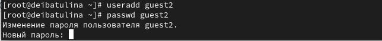{#fig:001 width=70%}

2. Добавляем пользователя *guest2* в группу *guest*, используя команду `gpasswd -a guest2 guest` (рис. [-@fig:002]).

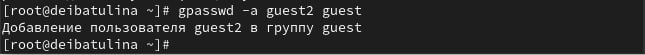{#fig:002 width=70%}

3. Осуществите вход в систему от двух пользователей на двух разных консолях: *guest* на первой консоли и *guest2* на второй консоли с помощью команды `su *имя пользователя*` (рис. [-@fig:003]).

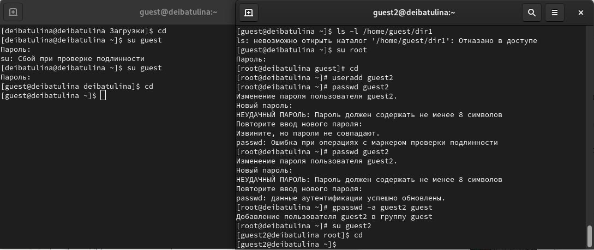{#fig:003 width=70%}

4. Далее, выведем рабочую директорию командой `pwd` для обоих пользователей: *guest* (рис. [-@fig:004]) и *guest2* (рис. [-@fig:005]):

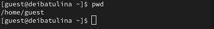{#fig:004 width=70%}

{#fig:005 width=70%}

5. Уточним имя обоих наших пользователей командой `whoami`, группу каждого, кто входит в неё
и к каким группам принадлежит он сам командой `id`: *guest* (рис. [-@fig:006]) и *guest2* (рис. [-@fig:007]).

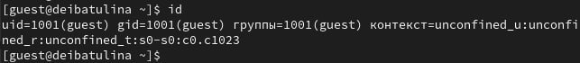{#fig:006 width=70%}

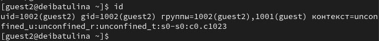{#fig:007 width=70%}

6. Определим командами `groups guest` и `groups guest2`, в какие группы входят пользователи: *guest* (рис. [-@fig:008]) и *guest2* (рис. [-@fig:009]). Сравним вывод команды `groups` с выводом команд `id -Gn` и `id -G` для пользователей *guest* (рис. [-@fig:010]) и *guest2* (рис. [-@fig:011]).

Примечательно:
* id -Gn - выведет названия групп, которым принадлежит пользователь
* id -G - выведет только код групп, которым принадлежит пользователь

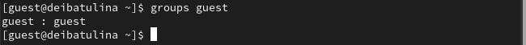{#fig:008 width=70%}

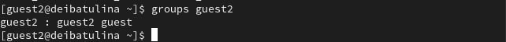{#fig:009 width=70%}

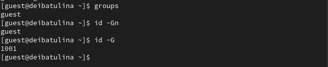{#fig:010 width=70%}

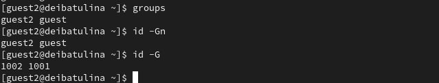{#fig:011 width=70%}

7. Просмотрим содержимое файла */etc/group* `cat /etc/group` (рис. [-@fig:012]).

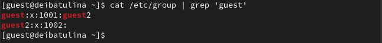{#fig:012 width=70%}

8. От имени пользователя *guest2* выполним регистрацию пользователя *guest2* в группе *guest* командой `newgrp guest` (рис. [-@fig:013]).

{#fig:013 width=70%}

9. От имени пользователя *guest* изменим права директории */home/guest*, разрешив все действия для пользователей группы с помощью команды `chmod g+rwx /home/guest` (рис. [-@fig:014]).

{#fig:014 width=70%}

10. От имени пользователя *guest* снимем с директории */home/guest/dir1* все атрибуты командой `chmod 000 dirl` (рис. [-@fig:015]).

{#fig:015 width=70%}

## Заполнение таблицы 3.1

Меняя атрибуты у директории *dir1* и файла *file1* от имени пользователя *guest* и делая проверку от пользователя *guest2*, заполняю таблицу [-@tbl:std-dir], определив опытным путём, какие операции разрешены, а какие нет. Если операция разрешена, в таблице стоит знак "+", если не разрешена, знак "-".

:  3.1 Установленные права и разрешённые действия для групп {#tbl:std-dir}

| Права директории | Права файла | Создание файла| Удаление файла | Запись в файл | Чтение файла | Смена директории | Просмотр файлов в директории | Переименование файл | Смена атрибутов файла |
|:---------------------|:---------------------|-----|-----|-----|-----|-----|-----|-----|-----|
|```d-------— (000)```|```--------— (000)```| - | - | - | - | - | - | - | - |
|```d-----x-— (010)```|```--------— (000)```| - | - | - | - | - | - | - | + |
|```d----w--— (020)```|```--------— (000)```| - | - | - | - | - | - | - | - |
|```d----wx-— (030)```|```--------— (000)```| + | + | - | - | + | - | + | + |
|```d---r---— (040)```|```--------— (000)```| - | - | - | - | - | + | - | - |
|```d---r-x-— (050)```|```--------— (000)```| - | - | - | - | + | + | - | + |
|```d---rw--— (060)```|```--------— (000)```| - | - | - | - | - | + | - | - |
|```d---rwx-— (070)```|```--------— (000)```| + | + | - | - | + | + | + | + |
|```d-------— (000)```|```------x-— (010)```| - | - | - | - | - | - | - | - |
|```d-----x-— (010)```|```------x-— (010)```| - | - | - | - | - | - | - | + |
|```d----w--— (020)```|```------x-— (010)```| - | - | - | - | - | - | - | - |
|```d----wx-— (030)```|```------x-— (010)```| + | + | - | - | + | - | + | + |
|```d---r---— (040)```|```------x-— (010)```| - | - | - | - | - | + | - | - |
|```d---r-x-— (050)```|```------x-— (010)```| - | - | - | - | + | + | - | + |
|```d---rw--— (060)```|```------x-— (010)```| - | - | - | - | - | + | - | - |
|```d---rwx-— (070)```|```------x-— (010)```| + | + | - | - | + | + | + | + |
|```d-------— (000)```|```-----w--— (020)```| - | - | - | - | - | - | - | - |
|```d-----x-— (010)```|```-----w--— (020)```| - | - | + | - | - | - | - | + |
|```d----w--— (020)```|```-----w--— (020)```| - | - | - | - | - | - | - | - |
|```d----wx-— (030)```|```-----w--— (020)```| + | + | + | - | + | - | + | + |
|```d---r---— (040)```|```-----w--— (020)```| - | - | - | - | - | + | - | - |
|```d---r-x-— (050)```|```-----w--— (020)```| - | - | + | - | + | + | - | + |
|```d---rw--— (060)```|```-----w--— (020)```| - | - | - | - | - | + | - | - |
|```d---rwx-— (070)```|```-----w--— (020)```| + | + | + | - | + | + | + | + |
|```d-------— (000)```|```-----wx-— (030)```| - | - | - | - | - | - | - | - |
|```d-----x-— (010)```|```-----wx-— (030)```| - | - | + | - | - | - | - | + |
|```d----w--— (020)```|```-----wx-— (030)```| - | - | - | - | - | - | - | - |
|```d----wx-— (030)```|```-----wx-— (030)```| + | + | + | - | + | - | + | + |
|```d---r---— (040)```|```-----wx-— (030)```| - | - | - | - | - | + | - | - |
|```d---r-x-— (050)```|```-----wx-— (030)```| - | - | + | - | + | + | - | + |
|```d---rw--— (060)```|```-----wx-— (030)```| - | - | - | - | - | + | - | - |
|```d---rwx-— (070)```|```-----wx-— (030)```| + | + | + | - | + | + | + | + |
|```d-------— (000)```|```----r---— (040)```| - | - | - | - | - | - | - | - |
|```d-----x-— (010)```|```----r---— (040)```| - | - | - | + | + | - | - | + |
|```d----w--— (020)```|```----r---— (040)```| - | - | - | - | - | - | - | - |
|```d----wx-— (030)```|```----r---— (040)```| + | + | - | + | + | - | + | + |
|```d---r---— (040)```|```----r---— (040)```| - | - | - | - | - | + | - | - |
|```d---r-x-— (050)```|```----r---— (040)```| - | - | - | + | + | + | - | + |
|```d---rw--— (060)```|```----r---— (040)```| - | - | - | - | - | + | - | - |
|```d---rwx-— (070)```|```----r---— (040)```| + | + | - | + | + | + | + | + |
|```d-------— (000)```|```----r-x-— (050)```| - | - | - | - | - | - | - | - |
|```d-----x-— (010)```|```----r-x-— (050)```| - | - | - | + | + | - | - | + |
|```d----w--— (020)```|```----r-x-— (050)```| - | - | - | - | - | - | - | - |
|```d----wx-— (030)```|```----r-x-— (050)```| + | + | - | + | + | - | + | + |
|```d---r---— (040)```|```----r-x-— (050)```| - | - | - | - | - | + | - | - |
|```d---r-x-— (050)```|```----r-x-— (050)```| - | - | - | + | + | + | - | + |
|```d---rw--— (060)```|```----r-x-— (050)```| - | -| - | - | - | + | - | - |
|```d---rwx-— (070)```|```----r-x-— (050)```| + | + | - | + | + | + | + | + |
|```d-------— (000)```|```----rw--— (060)```| - | - | - | - | - | - | - | - |
|```d-----x-— (010)```|```----rw--— (060)```| - | - | + | + | - | - | - | + |
|```d----w--— (020)```|```----rw--— (060)```| - | - | - | - | - | - | - | - |
|```d----wx-— (030)```|```----rw--— (060)```| + | + | + | + | + | - | + | + |
|```d---r---— (040)```|```----rw--— (060)```| - | - | - | - | - | + | - | - |
|```d---r-x-— (050)```|```----rw--— (060)```| - | - | + | + | + | + | - | + |
|```d---rw--— (060)```|```----rw--— (060)```| - | - | - | - | - | + | - | - |
|```d---rwx-— (070)```|```----rw--— (060)```| + | + | + | + | + | + | + | + |
|```d-------— (000)```|```----rwx-— (070)```| - | - | - | - | - | - | - | - |
|```d-----x-— (010)```|```----rwx-— (070)```| - | - | + | + | + | - | - | + |
|```d----w--— (020)```|```----rwx-— (070)```| - | - | - | - | - | - | - | - |
|```d----wx-— (030)```|```----rwx-— (070)```| + | + | + | + | + | - | + | + |
|```d---r---— (040)```|```----rwx-— (070)```| - | - | - | - | - | + | - | - |
|```d---r-x-— (050)```|```----rwx-— (070)```| - | - | + | + | + | + | - | + |
|```d---rw--— (060)```|```----rwx-— (070)```| - | - | - | - | - | + | - | - |
|```d---rwx-— (070)```|```----rwx-— (070)```| + | + | + | + | + | + | + | + |

## Заполнение таблицы 3.2

На основе таблицы 3.1 заполняю следующую таблицу [-@tbl:std-dir1].

: 3.2 Минимальные права для совершения операций от имени пользователей, входящих в группу {#tbl:std-dir1}


| Операция | Права на директорию | Права на файл |
|------------------------|---------------------------------|---------------------------|
| Создание файла | ```d----wx-— (030)``` | ```--------— (000)``` |
| Удаление файла | ```d----wx-— (030)``` | ```--------— (000)``` |
| Чтение файла | ```d-----x-— (010)``` | ```----r---— (040)``` |
| Запись в файл | ```d-----x-— (010)``` | ```-----w--— (020)``` |
| Переименование файла | ```d----wx-— (030)``` | ```--------— (000)``` |
| Создание поддиректории | ```d----wx-— (030)``` | ```--------— (000)``` |
| Удаление поддиректории | ```d----wx-— (030)``` | ```--------— (000)``` |

# Выводы

Я получила практические навыки работы в консоли с атрибутами файлов для групп пользователей.

# Список литературы{.unnumbered}

::: {#refs}
:::
