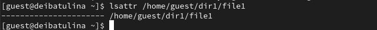
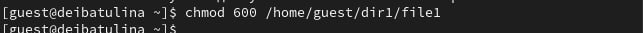
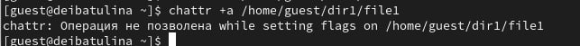
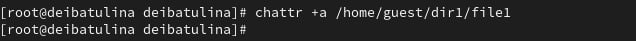
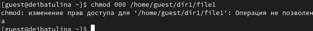
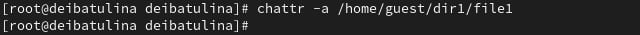
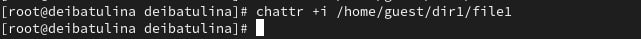
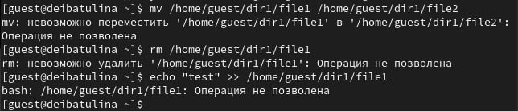

---
## Front matter
lang: ru-RU
title: Презентация по лабораторной работе №4
subtitle: Дискреционное разграничение прав в Linux. Расширенные атрибуты
author:
  - Ибатулина Д.Э.
institute:
  - Российский университет дружбы народов, Москва, Россия
date: 28 марта 2024

## i18n babel
babel-lang: russian
babel-otherlangs: english

## Formatting pdf
toc: false
toc-title: Содержание
slide_level: 2
aspectratio: 169
section-titles: true
theme: metropolis
header-includes:
 - \metroset{progressbar=frametitle,sectionpage=progressbar,numbering=fraction}
 - '\makeatletter'
 - '\beamer@ignorenonframefalse'
 - '\makeatother'
---

# Информация

## Докладчик

:::::::::::::: {.columns align=center}
::: {.column width="70%"}

  * Ибатулина Дарья Эдуардовна
  * студентка группы НКАбд-01-22
  * факультет физико-математических и естественных наук
  * Российский университет дружбы народов
  * [deibatulina.github.io](mailto:1132226434@pfur.ru)
  * <https://github.com/deibatulina>

:::
::: {.column width="30%"}

:::
::::::::::::::

# Вводная часть

## Актуальность

Навыки работы с атрибутами (их установка и снятие), а также навык установки и ограничения прав доступа в ОС - неотъемлемое умение специалиста по информационной безопасности.

## Цели и задачи

Снимать и устанавливать атрибуты и права доступа на файл `file1` от имени администратора и гостя. В зависимости от установленных атрибутов понять, какие действия с файлом разрешены, а какие запрещены.

# Выполнение

## Проверка установленных на файл атрибутов

От имени пользователя `guest` определяю расширенные атрибуты файла `/home/guest/dir1/file1`.

## Установка прав на чтение и запись для владельца файла

Установлю командой `chmod 600 file1` на файл `file1` права, разрешающие чтение и запись для владельца файла.

## Попытка установки расширенного атрибута от имени пользователя guest

Пробую установить на файл `/home/guest/dir1/file1` расширенный атрибут `a` от имени пользователя `guest`:
`chattr +a /home/guest/dir1/file1`. В ответ получаю отказ от выполнения операции

## Попытка установки расширенного атрибута от имени пользователя root

Теперь проделаю то же самое, но под учётной записью администратора.

## Действия с файлом

Я смогла лишь дозаписать в файл, но установить на него права, удалить или переименовать его мне не удалось.

## Снятие расширенного атрибута `a` с файла `/home/guest/dirl/file1` от имени суперпользователя

Снимаю расширенный атрибут `a` с файла `/home/guest/dirl/file1` от имени суперпользователя.

## Снятие всех атрибутов с файла

Теперь я могу как переименовать файл, так и изменять права доступа к нему.

## Замена атрибута "a" на атрибут "i", повтор всех выполненных ранее действий

Повторяю свои действия по шагам, заменив атрибут «a» атрибутом «i». В случае `guest` получаю ошибку, в случае `root` команда успешно выполняется.

## Все дествия с файлом теперь запрещены

От имени пользователя `guest` переименовать, удалить, либо записать файл `file1` теперь нельзя.

## Результаты

В результате выполнения работы я:

* повысила свои навыки использования интерфейса командой строки (CLI), познакомилась на примерах с тем, как используются основные и расширенные атрибуты при разграничении доступа.

* имела возможность связать теорию дискреционного разделения доступа (дискреционная политика безопасности) с её реализацией на практике в ОС Linux.

* опробовали действие на практике расширенных атрибутов «а» и «i».

