---
## Front matter
title: "Отчёт по лабораторной работе №4"
subtitle: "Дискреционное разграничение прав в Linux. Расширенные атрибуты"
author: "Дарья Эдуардовна Ибатулина"

## Generic otions
lang: ru-RU
toc-title: "Содержание"

## Bibliography
bibliography: bib/cite.bib
csl: pandoc/csl/gost-r-7-0-5-2008-numeric.csl

## Pdf output format
toc: true # Table of contents
toc-depth: 2
lof: true # List of figures
lot: true # List of tables
fontsize: 12pt
linestretch: 1.5
papersize: a4
documentclass: scrreprt
## I18n polyglossia
polyglossia-lang:
  name: russian
  options:
	- spelling=modern
	- babelshorthands=true
polyglossia-otherlangs:
  name: english
## I18n babel
babel-lang: russian
babel-otherlangs: english
## Fonts
mainfont: PT Serif
romanfont: PT Serif
sansfont: PT Sans
monofont: PT Mono
mainfontoptions: Ligatures=TeX
romanfontoptions: Ligatures=TeX
sansfontoptions: Ligatures=TeX,Scale=MatchLowercase
monofontoptions: Scale=MatchLowercase,Scale=0.9
## Biblatex
biblatex: true
biblio-style: "gost-numeric"
biblatexoptions:
  - parentracker=true
  - backend=biber
  - hyperref=auto
  - language=auto
  - autolang=other*
  - citestyle=gost-numeric
## Pandoc-crossref LaTeX customization
figureTitle: "Рис."
tableTitle: "Таблица"
listingTitle: "Листинг"
lofTitle: "Список иллюстраций"
lotTitle: "Список таблиц"
lolTitle: "Листинги"
## Misc options
indent: true
header-includes:
  - \usepackage{indentfirst}
  - \usepackage{float} # keep figures where there are in the text
  - \floatplacement{figure}{H} # keep figures where there are in the text
---

# Цель работы

Получение практических навыков работы в консоли с расширенными атрибутами файлов.

# Задание

Снимать и устанавливать атрибуты и права доступа на файл `file1` от имени администратора и гостя. В зависимости от установленных атрибутов понять, какие действия с файлом разрешены, а какие запрещены.

# Теоретическое введение

Права доступа определяют, какие действия конкретный пользователь может или не может совершать с определенным файлами и каталогами. С помощью разрешений можно создать надежную среду — такую, в которой никто не может поменять содержимое ваших документов или повредить системные файлы.

Расширенные атрибуты файлов Linux представляют собой пары имя:значение, которые постоянно связаны с файлами и каталогами, подобно тому как строки окружения связаны с процессом. Атрибут может быть определён или не определён. Если он определён, то его значение может быть или пустым, или не пустым.

Расширенные атрибуты дополняют обычные атрибуты, которые связаны со всеми inode в файловой системе (т. е., данные stat(2)). Часто они используются для предоставления дополнительных возможностей файловой системы, например, дополнительные возможности безопасности, такие как списки контроля доступа (ACL), могут быть реализованы через расширенные атрибуты.

Установить атрибуты:

* chattr filename

Значения:

* chattr +a # только добавление. Удаление и переименование запрещено;

* chattr +A # не фиксировать данные об обращении к файлу

* chattr +c # сжатый файл

* chattr +d # неархивируемый файл

* chattr +i # неизменяемый файл

* chattr +S # синхронное обновление

* chattr +s # безопасное удаление, (после удаления место на диске переписывается нулями)

* chattr +u # неудаляемый файл

* chattr -R # рекурсия

Просмотреть атрибуты:

* lsattr filename

Опции:

* lsattr -R # рекурсия

* lsattr -a # вывести все файлы (включая скрытые)

* lsattr -d # не выводить содержимое директории

# Выполнение лабораторной работы

1. От имени пользователя `guest` определяю расширенные атрибуты файла `/home/guest/dir1/file1` командой
`lsattr /home/guest/dir1/file1` (рис. [-@fig:001]):

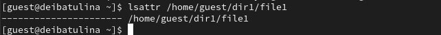{#fig:001 width=70%}

2. Установлю командой `chmod 600 file1` на файл `file1` права, разрешающие чтение и запись для владельца файла (рис. [-@fig:002]):

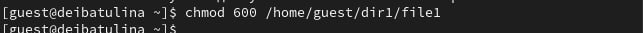{#fig:002 width=70%}

3. Пробую установить на файл `/home/guest/dir1/file1` расширенный атрибут `a` от имени пользователя `guest`:
`chattr +a /home/guest/dir1/file1`.	
В ответ получаю отказ от выполнения операции (рис. [-@fig:003]):

{#fig:003 width=70%}

4. Теперь проделаю то же самое, но под учётной записью администратора (рис. [-@fig:004]):

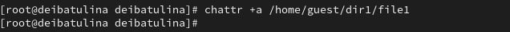{#fig:004 width=70%}

5. От пользователя `guest` проверяю правильность установления атрибута при помощи команды `lsattr /home/guest/dir1/file1` (рис. [-@fig:005]):

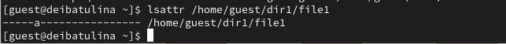{#fig:005 width=70%}

6. Выполняю дозапись в файл `file1` слова «test» командой `echo >> "test" /home/guest/dir1/file1`.
Также дозапишу в файл и строку "abcd": `echo "abcd" > /home/guest/dirl/file1`. После этого выполняю чтение файла `file1` командой `cat /home/guest/dir1/file1`. Убедилась, что слова "test" и "abcd" были успешно записаны в file1 (рис. [-@fig:006]):

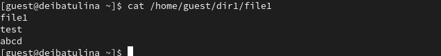{#fig:006 width=70%}

7. Пытаюсь удалить или переименовать файл `file1`. Но получаю отказ (рис. [-@fig:007], [-@fig:008]):

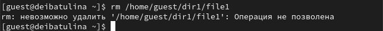{#fig:007 width=70%}

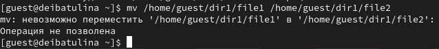{#fig:008 width=70%}

8. Устанавливаю командой `chmod 000 file1` права, запрещающие чтение и запись для владельца файла. Успешно выполнить данную команду мне не удалось (рис. [-@fig:009]):

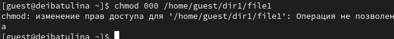{#fig:009 width=70%}

9. Снимаю расширенный атрибут `a` с файла `/home/guest/dirl/file1` от имени суперпользователя командой
`chattr -a /home/guest/dir1/file1` (рис. [-@fig:010]):

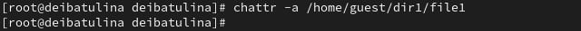{#fig:010 width=70%}

10. Повторяю операции, которые ранее не удавалось выполнить. Это переименование файла и изменение прав доступа к файлу. Удалить я бы тоже смогла, но не стала этого делать, так как в дальнейшем этот файл пригодится (рис. [-@fig:011], [-@fig:012]):

{#fig:011 width=70%}

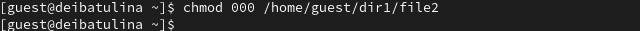{#fig:012 width=70%}

11. Повторяю свои действия по шагам, заменив атрибут «a» атрибутом «i». В случае `guest` получаю ошибку, в случае `root` команда успешно выполняется (рис. [-@fig:013], [-@fig:014]):

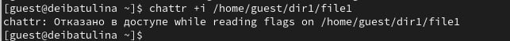{#fig:013 width=70%}

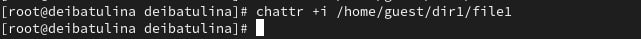{#fig:014 width=70%}

12. От имени пользователя `guest` переименовать, удалить, либо записать файл `file1` теперь нельзя (рис. [-@fig:015]):

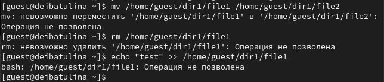{#fig:015 width=70%}

# Выводы

В результате выполнения работы я повысила свои навыки использования интерфейса командой строки (CLI), познакомилась на примерах с тем, как используются основные и расширенные атрибуты при разграничении
доступа. Имела возможность связать теорию дискреционного разделения доступа (дискреционная политика безопасности) с её реализацией на практике в ОС Linux. Опробовала действие на практике расширенных атрибутов «а» и «i».

# Список литературы{.unnumbered}

::: {#refs}
:::
