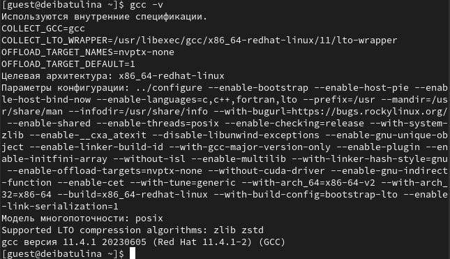
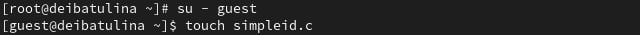
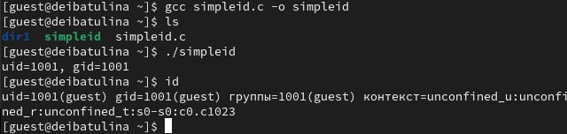
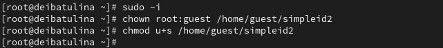
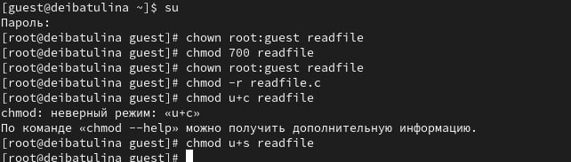
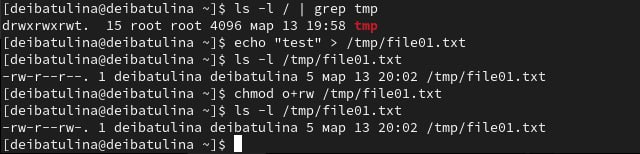
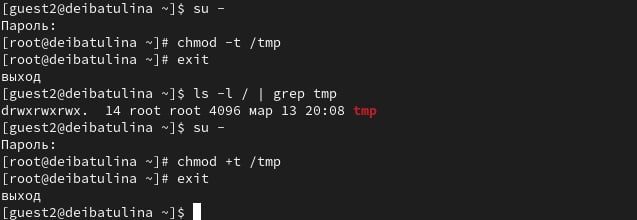

---
## Front matter
lang: ru-RU
title: Презентация по лабораторной работе №5
subtitle:  Дискреционное разграничение прав в Linux. Исследование влияния дополнительных атрибутов
author:
  - Ибатулина Д.Э.
institute:
  - Российский университет дружбы народов, Москва, Россия
date: 13 апреля 2024

## i18n babel
babel-lang: russian
babel-otherlangs: english

## Formatting pdf
toc: false
toc-title: Содержание
slide_level: 2
aspectratio: 169
section-titles: true
theme: metropolis
header-includes:
 - \metroset{progressbar=frametitle,sectionpage=progressbar,numbering=fraction}
 - '\makeatletter'
 - '\beamer@ignorenonframefalse'
 - '\makeatother'
---

# Информация

## Докладчик

:::::::::::::: {.columns align=center}
::: {.column width="70%"}

  * Ибатулина Дарья Эдуардовна
  * студентка группы НКАбд-01-22
  * факультет физико-математических и естественных наук
  * Российский университет дружбы народов
  * [deibatulina.github.io](mailto:1132226434@pfur.ru)
  * <https://github.com/deibatulina>

:::
::: {.column width="30%"}

:::
::::::::::::::

# Вводная часть

## Актуальность

Навыки работы с атрибутами (их установка и снятие), а также навык компиляции программных файлов и их исполнения - неотъемлемое умение специалиста по информационной безопасности.

## Цели и задачи

Изучение механизмов изменения идентификаторов, применения SetUID- и Sticky-битов. Получение практических навыков работы в консоли с дополнительными атрибутами. Рассмотрение работы механизма смены идентификатора процессов пользователей, а также влияние бита *Sticky* на запись и удаление файлов.

# Выполнение

## Подготовка лабораторного стенда

Проверяем, установлен ли gcc.

## Создание программного файла

Переключаемся на учетную запись администратора и создаем файл `simpleid.c`, заполняем его предложенной программой.

## Компиляция и исполнение файла

Компилирую и привожу файл в исполнение.

## Смена пользователя файла на root и установка SetUID-бита

Теперь проделаю то же самое, но под учётной записью администратора.

## Действия с файлом

Создаём файл `readfile.c` и изменяем его владельца так, чтобы только суперпользователь мог прочитать его, а guest не мог.

## Исследование Sticky-бита

Выясним, установлен ли атрибут Sticky на директории /tmp, от имени пользователя guest создадим файл file01.txt в директории /tmp со словом test, и просмотрим атрибуты у только что созданного файла и разрешим чтение и запись для категории пользователей «все остальные».

## Изменение атрибутов файла

Повысим свои права до суперпользователя и выполним после этого команду, снимающую атрибут t (Sticky-бит) с директории /tmp, а затем покинем режим суперпользователя. От пользователя guest2 проверим, что атрибута t у директории /tmp нет.
Повторив предыдущие шаги от имени других пользователей, я могу заметить, что всё получается. 
Отвечая на вопрос: Удалось ли вам удалить файл от имени пользователя, не являющегося его владельцем? я могу сказать, что удалось.
Повысим свои права до суперпользователя и вернём атрибут t на директорию /tmp

## Результаты

Мною были изучены механизмы изменения идентификаторов и применения SetUID- и Sticky-битов. Получены практические навыки работы в консоли с дополнительными атрибутами. Были рассмотрены работа механизма смены идентификатора процессов пользователей, а также влияние бита Sticky на запись и удаление файлов.

