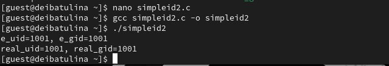

---
## Front matter
title: "Лабораторная работа №5"
subtitle: "Дискреционное разграничение прав в Linux. Исследование влияния дополнительных атрибутов"
author: "Дарья Эдуардовна Ибатулина"

## Generic otions
lang: ru-RU
toc-title: "Содержание"

## Bibliography
bibliography: bib/cite.bib
csl: pandoc/csl/gost-r-7-0-5-2008-numeric.csl

## Pdf output format
toc: true # Table of contents
toc-depth: 2
lof: true # List of figures
lot: true # List of tables
fontsize: 12pt
linestretch: 1.5
papersize: a4
documentclass: scrreprt
## I18n polyglossia
polyglossia-lang:
  name: russian
  options:
	- spelling=modern
	- babelshorthands=true
polyglossia-otherlangs:
  name: english
## I18n babel
babel-lang: russian
babel-otherlangs: english
## Fonts
mainfont: PT Serif
romanfont: PT Serif
sansfont: PT Sans
monofont: PT Mono
mainfontoptions: Ligatures=TeX
romanfontoptions: Ligatures=TeX
sansfontoptions: Ligatures=TeX,Scale=MatchLowercase
monofontoptions: Scale=MatchLowercase,Scale=0.9
## Biblatex
biblatex: true
biblio-style: "gost-numeric"
biblatexoptions:
  - parentracker=true
  - backend=biber
  - hyperref=auto
  - language=auto
  - autolang=other*
  - citestyle=gost-numeric
## Pandoc-crossref LaTeX customization
figureTitle: "Рис."
tableTitle: "Таблица"
listingTitle: "Листинг"
lofTitle: "Список иллюстраций"
lotTitle: "Список таблиц"
lolTitle: "Листинги"
## Misc options
indent: true
header-includes:
  - \usepackage{indentfirst}
  - \usepackage{float} # keep figures where there are in the text
  - \floatplacement{figure}{H} # keep figures where there are in the text
---

# Цель работы

Изучение механизмов изменения идентификаторов, применения SetUID- и Sticky-битов. Получение практических навыков работы в консоли с дополнительными атрибутами. Рассмотрение работы механизма смены идентификатора процессов пользователей, а также влияние бита *Sticky* на запись и удаление файлов.

# Задание

1. Подготовить лабораторный стенд;
2. Поработать с компилятором gcc;
3. Попрактиковаться в установке и снятии атрибутов с файлов.

# Теоретическое введение

1. Дополнительные атрибуты файлов Linux

В Linux существует три основных вида прав — право на чтение (read), запись (write) и выполнение (execute), а также три категории пользователей, к которым они могут применяться — владелец файла (user), группа владельца (group) и все остальные (others). Но, кроме прав чтения, выполнения и записи, есть еще три дополнительных атрибута. [1]

Sticky bit
Используется в основном для каталогов, чтобы защитить в них файлы. В такой каталог может писать любой пользователь. Но, из такой директории пользователь может удалить только те файлы, владельцем которых он является. Примером может служить директория /tmp, в которой запись открыта для всех пользователей, но нежелательно удаление чужих файлов.

SUID (Set User ID)
Атрибут исполняемого файла, позволяющий запустить его с правами владельца. В Linux приложение запускается с правами пользователя, запустившего указанное приложение. Это обеспечивает дополнительную безопасность т.к. процесс с правами пользователя не сможет получить доступ к важным системным файлам, которые принадлежат пользователю root.

SGID (Set Group ID)
Аналогичен suid, но относиться к группе. Если установить sgid для каталога, то все файлы созданные в нем, при запуске будут принимать идентификатор группы каталога, а не группы владельца, который создал файл в этом каталоге.

Обозначение атрибутов sticky, suid, sgid
Специальные права используются довольно редко, поэтому при выводе программы ls -l символ, обозначающий указанные атрибуты, закрывает символ стандартных прав доступа.

Пример:

rwsrwsrwt

где первая s — это suid, вторая s — это sgid, а последняя t — это sticky bit

В приведенном примере не понятно, rwt — это rw- или rwx? Определить это просто. Если t маленькое, значит x установлен. Если T большое, значит x не установлен. То же самое правило распространяется и на s.

В числовом эквиваленте данные атрибуты определяются первым символом при четырехзначном обозначении (который часто опускается при назначении прав), например в правах 1777 — символ 1 обозначает sticky bit. Остальные атрибуты имеют следующие числовое соответствие:

1 — установлен sticky bit
2 — установлен sgid
4 — установлен suid
2. Компилятор GCC

GСС - это свободно доступный оптимизирующий компилятор для языков C, C++. Собственно программа gcc это некоторая надстройка над группой компиляторов, которая способна анализировать имена файлов, передаваемые ей в качестве аргументов, и определять, какие действия необходимо выполнить. Файлы с расширением .cc или .C рассматриваются, как файлы на языке C++, файлы с расширением .c как программы на языке C, а файлы c расширением .o считаются объектными. [2]

# Выполнение лабораторной работы

## Подготовка лабораторного стенда

Проверяем, установлен ли gcc (рис. [-@fig:001]).

{#fig:001 width=70%}

Устанавливаем setenforce 0 и проверяем что getenforce выдает: "Permissive" (рис. [-@fig:002]).

{#fig:002 width=70%}

## Создание программы

Переключаемся на учетную запись администратора и создаем файл `simpleid.c`, заполняем его предложенной программой (рис. [-@fig:003], [-@fig:004]).

{#fig:003 width=70%}

{#fig:004 width=70%}

Скомпилируем программу, выполним её и сравним вывод команды `id` с результатом исполнения программы. Они совпадают (рис. [-@fig:005]).

{#fig:005 width=70%}

Листинг программы файла simpleid.c:

```
#include <sys/types.h>
#include <unistd.h>
#include <stdio.h>
int
main ()
{
	uid_t uid = geteuid ();
	gid_t gid = getegid ();
	printf ("uid=%d, gid=%d\n", uid, gid);
	return 0;
}
```

Создадим другой файл simpleid2.c, введём в него код более сложной программы, выполним его (рис. [-@fig:006], [-@fig:007]).

{#fig:006 width=70%}

{#fig:007 width=70%}

Листинг программы файла simpleid2.c:

```
#include <sys/types.h>
#include <unistd.h>
#include <stdio.h>
int
main ()
{
	uid_t real_uid = getuid ();
	uid_t e_uid = geteuid ();
	gid_t real_gid = getgid ();
	gid_t e_gid = getegid () ;
	printf ("e_uid=%d, e_gid=%d\n", e_uid, e_gid);
	printf ("real_uid=%d, real_gid=%d\n", real_uid, real_gid);
	return 0;
}

```

Переключаемся на администратора и выполняем следующие команды (рис. [-@fig:008]).

{#fig:008 width=70%}

Этими командами была произведена смена пользователя файла на root и установлен SetUID-бит.

Выполним проверку правильности установки атрибутов, а также скомпилируем и запустим файл simleid2, сравним результат с выводом команды `id` (рис. [-@fig:009]).

{#fig:009 width=70%}

Создаём файл readfile.c (рис. [-@fig:010]) и изменяем его владельца так, чтобы только суперпользователь мог прочитать его, а guest не мог (рис. [-@fig:011]).

{#fig:010 width=70%}

{#fig:011 width=70%}

Листинг программы файла readfile.c:

```
#include <fcntl.h>
#include <stdio.h>
#include <sys/stat.h>
#include <sys/types.h>
#include <unistd.h>
int
main (int argc, char* argv[])
{
	unsigned char buffer[16];
	size_t bytes_read;
	int i;
	int fd = open (argv[1], O_RDONLY);
	do
	{
		bytes_read = read (fd, buffer, sizeof (buffer));
		for (i =0; i < bytes_read; ++i) printf("%c", buffer[i]);
	}
	while (bytes_read == sizeof (buffer));
	close (fd);
	return 0;
}
```

Проверим, что пользователь guest не может прочитать данный файл. Также программа readfile не сможет прочитать файл readfile.c и readfile не может прочитать файл /etc/shadow (рис. [-@fig:012]).

{#fig:012 width=70%}

Но от имени суперпользователя удаётся выполнить все вышеприведённые команды (рис. [-@fig:013], [-@fig:014]).

{#fig:013 width=70%}

{#fig:014 width=70%}

## Исследование Sticky-бита

Выясним, установлен ли атрибут Sticky на директории /tmp, от имени пользователя guest создадим файл file01.txt в директории /tmp со словом test, и просмотрим атрибуты у только что созданного файла и разрешим чтение и запись для категории пользователей «все остальные» (рис. [-@fig:015]).

{#fig:015 width=70%}

От пользователя guest2 (не являющегося владельцем) попробуем прочитать файл /tmp/file01.txt:, от пользователя guest2 попробуем дозаписать в файл /tmp/file01.txt слово test2, проверим содержимое файла, от пользователя guest2 попробуем записать в файл /tmp/file01.txt слово test3, стерев при этом всю имеющуюся в файле информацию и проверим содержимое файла (рис. [-@fig:016]).

{#fig:016 width=70%}

Удалить данный файл от имени guest2 не удаётся.

Повысим свои права до суперпользователя и выполним после этого команду, снимающую атрибут t (Sticky-бит) с директории /tmp, а затем покинем режим суперпользователя. От пользователя guest2 проверим, что атрибута t у директории /tmp нет.
Повторив предыдущие шаги от имени других пользователей, я могу заметить, что всё получается. 
Отвечая на вопрос: Удалось ли вам удалить файл от имени пользователя, не являющегося его владельцем? я могу сказать, что удалось.
Повысим свои права до суперпользователя и вернём атрибут t на директорию /tmp (рис. [-@fig:017]).

{#fig:017 width=70%}

# Выводы

Мною были изучены механизмы изменения идентификаторов и применения SetUID- и Sticky-битов. Получены практические навыки работы в консоли с дополнительными атрибутами. Были рассмотрены работа механизма смены идентификатора процессов пользователей, а также влияние бита Sticky на запись и удаление файлов.

# Список литературы{.unnumbered}

::: {#refs}

[0] Методические материалы курса

[1] Дополнительные атрибуты: https://tokmakov.msk.ru/blog/item/141

[2] Компилятор GSS: http://parallel.imm.uran.ru/freesoft/make/instrum.html

:::
