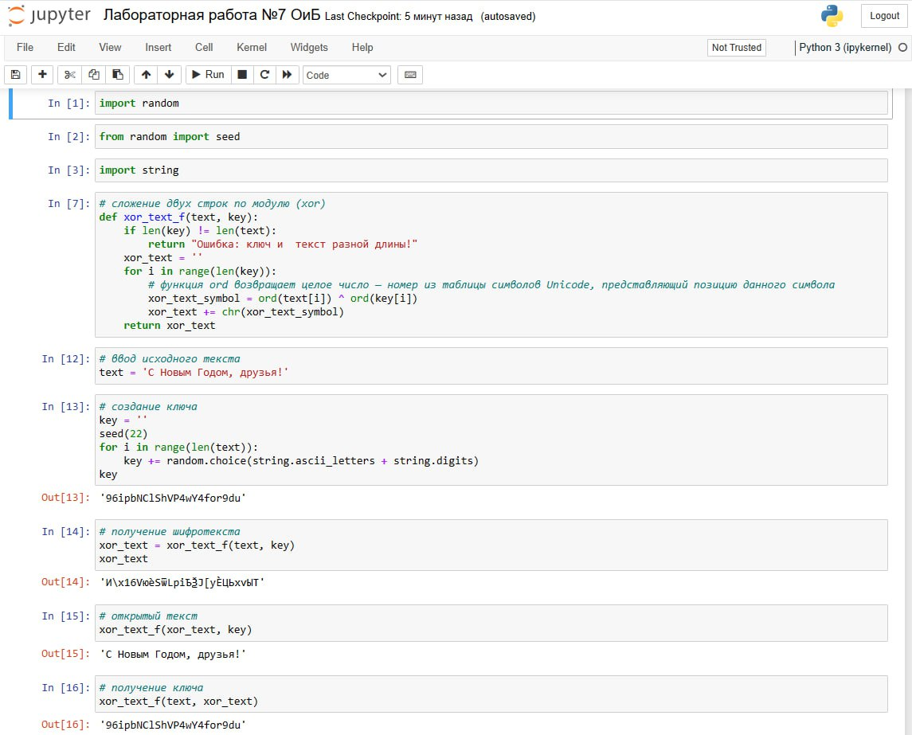

---
## Front matter
lang: ru-RU
title: Презентация по лабораторной работе №7
subtitle: Элементы криптографии. Однократное гаммирование
author:
  - Ибатулина Д.Э.
institute:
  - Российский университет дружбы народов, Москва, Россия
date: 10 мая 2024

## i18n babel
babel-lang: russian
babel-otherlangs: english

## Formatting pdf
toc: false
toc-title: Содержание
slide_level: 2
aspectratio: 169
section-titles: true
theme: metropolis
header-includes:
 - \metroset{progressbar=frametitle,sectionpage=progressbar,numbering=fraction}
 - '\makeatletter'
 - '\beamer@ignorenonframefalse'
 - '\makeatother'
---

# Информация

## Докладчик

:::::::::::::: {.columns align=center}
::: {.column width="70%"}

  * Ибатулина Дарья Эдуардовна
  * студентка группы НКАбд-01-22
  * факультет физико-математических и естественных наук
  * Российский университет дружбы народов
  * [deibatulina.github.io](mailto:1132226434@pfur.ru)
  * <https://github.com/deibatulina>

:::
::: {.column width="30%"}

:::
::::::::::::::

# Вводная часть

## Актуальность

Решение задач шифрования является очень важным умением для специалиста по информационной безопасности.

## Цели и задачи

Освоить на практике применение режима однократного гаммирования.

Нужно подобрать ключ, чтобы получить сообщение: "С Новым Годом, друзья!". Требуется разработать приложение, позволяющее шифровать и дешифровать данные в режиме одднократного гаммирования. Приложение должно:

1. Определить вид шифротекста при известном ключе и известном открытом тексте.

2. Определить ключ, с помощью которого шифротекст может быть преобразован в некоторый фрагмент текста, представляющий собой один и возможных вариантов прочтения открытого текса.

# Выполнение

## Код программы

{#fig:001 width=60%}

## Результаты

В ходе выполнения лабораторной работы я научилась зашифровывать и дешифровывать сообщения путем применения однократного гаммирования, познакомилась с этим способом в криптографии.

