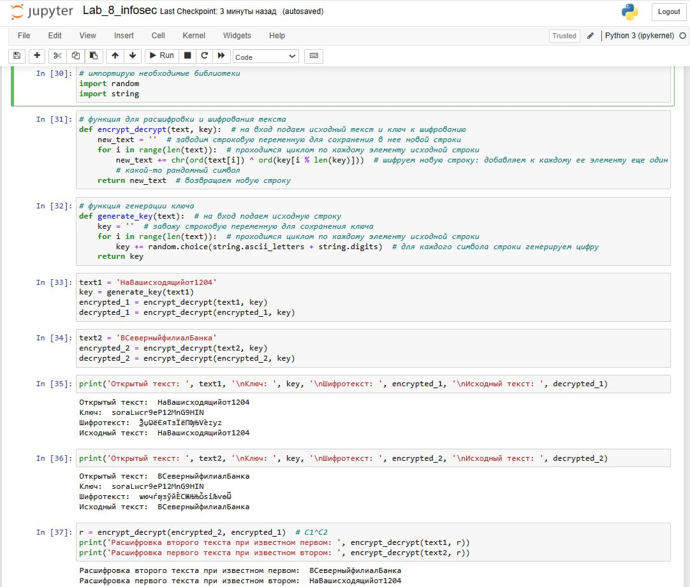

---
## Front matter
lang: ru-RU
title: Презентация по лабораторной работе №8
subtitle:  Элементы криптографии. Шифрование (кодирование) различных исходных текстов одним ключом
author:
  - Ибатулина Д.Э.
institute:
  - Российский университет дружбы народов, Москва, Россия
date: 17 мая 2024

## i18n babel
babel-lang: russian
babel-otherlangs: english

## Formatting pdf
toc: false
toc-title: Содержание
slide_level: 2
aspectratio: 169
section-titles: true
theme: metropolis
header-includes:
 - \metroset{progressbar=frametitle,sectionpage=progressbar,numbering=fraction}
 - '\makeatletter'
 - '\beamer@ignorenonframefalse'
 - '\makeatother'
---

# Информация

## Докладчик

:::::::::::::: {.columns align=center}
::: {.column width="70%"}

  * Ибатулина Дарья Эдуардовна
  * студентка группы НКАбд-01-22
  * факультет физико-математических и естественных наук
  * Российский университет дружбы народов
  * [deibatulina.github.io](mailto:1132226434@pfur.ru)
  * <https://github.com/deibatulina>

:::
::: {.column width="30%"}

:::
::::::::::::::

# Вводная часть

## Актуальность

Решение задач шифрования является очень важным умением для специалиста по информационной безопасности.

## Цель

Освоить на практике применение режима однократного гаммирования на примере кодирования различных исходных текстов одним ключом.

## Задачи

Два текста кодируются одним ключом (однократное гаммирование). Требуется не зная ключа и не стремясь его определить, прочитать оба текста. Необходимо разработать приложение, позволяющее шифровать и дешифровать тексты P1 и P2 в режиме однократного гаммирования. Приложение должно определить вид шифротекстов C1 и C2 обоих текстов P1 и P2 при известном ключе. Необходимо определить и выразить аналитически способ, при котором злоумышленник может прочитать оба текста, не зная ключа и не стремясь его определить.

# Выполнение

## Код программы

{#fig:001 width=55%}

## Результаты

В ходе выполнения лабораторной работы я научилась шифровать различные исходные тексты одним ключом.

