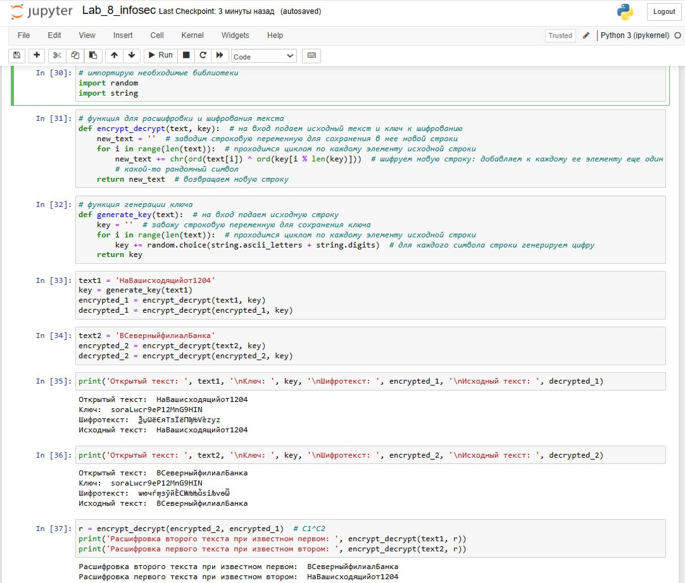

---
## Front matter
title: "Отчет по лабораторной работе №8"
subtitle: "Элементы криптографии. Шифрование (кодирование) различных исходных текстов одним ключом"
author: "Дарья Эдуардовна Ибатулина"

## Generic otions
lang: ru-RU
toc-title: "Содержание"

## Bibliography
bibliography: bib/cite.bib
csl: pandoc/csl/gost-r-7-0-5-2008-numeric.csl

## Pdf output format
toc: true # Table of contents
toc-depth: 2
lof: true # List of figures
lot: true # List of tables
fontsize: 12pt
linestretch: 1.5
papersize: a4
documentclass: scrreprt
## I18n polyglossia
polyglossia-lang:
  name: russian
  options:
	- spelling=modern
	- babelshorthands=true
polyglossia-otherlangs:
  name: english
## I18n babel
babel-lang: russian
babel-otherlangs: english
## Fonts
mainfont: PT Serif
romanfont: PT Serif
sansfont: PT Sans
monofont: PT Mono
mainfontoptions: Ligatures=TeX
romanfontoptions: Ligatures=TeX
sansfontoptions: Ligatures=TeX,Scale=MatchLowercase
monofontoptions: Scale=MatchLowercase,Scale=0.9
## Biblatex
biblatex: true
biblio-style: "gost-numeric"
biblatexoptions:
  - parentracker=true
  - backend=biber
  - hyperref=auto
  - language=auto
  - autolang=other*
  - citestyle=gost-numeric
## Pandoc-crossref LaTeX customization
figureTitle: "Рис."
tableTitle: "Таблица"
listingTitle: "Листинг"
lofTitle: "Список иллюстраций"
lotTitle: "Список таблиц"
lolTitle: "Листинги"
## Misc options
indent: true
header-includes:
  - \usepackage{indentfirst}
  - \usepackage{float} # keep figures where there are in the text
  - \floatplacement{figure}{H} # keep figures where there are in the text
---

# Цель работы

Освоить на практике применение режима однократного гаммирования на примере кодирования различных исходных текстов одним ключом.

# Задание

Два текста кодируются одним ключом (однократное гаммирование). Требуется не зная ключа и не стремясь его определить, прочитать оба текста. Необходимо разработать приложение, позволяющее шифровать и дешифровать тексты P1 и P2 в режиме однократного гаммирования. Приложение должно определить вид шифротекстов C1 и C2 обоих текстов P1 и P2 при известном ключе. Необходимо определить и выразить аналитически способ, при котором злоумышленник может прочитать оба текста, не зная ключа и не стремясь его определить.

# Теоретическое введение

Исходные данные.

Две телеграммы Центра:

P1 = НаВашисходящийот1204

P2 = ВСеверныйфилиалБанка

Ключ Центра длиной 20 байт: K = 05 0C 17 7F 0E 4E 37 D2 94 10 09 2E 22 57 FF C8 OB B2 70 54

Шифротексты обеих телеграмм можно получить по формулам режима однократного гаммирования:

C1 = P1 ⊕ K,
C2 = P2 ⊕ K.

Открытый текст можно найти, зная шифротекст двух телеграмм, зашифрованных одним ключом. Для это оба равенства складываются по модулю 2. Тогда с учётом свойства операции XOR:

1 ⊕ 1 = 0, 1 ⊕ 0 = 1

получаем:

C1 ⊕ C2 = P1 ⊕ K ⊕ P2 ⊕ K = P1 ⊕ P2.

Предположим, что одна из телеграмм является шаблоном — т.е. имеет текст фиксированный формат, в который вписываются значения полей. Допустим, что злоумышленнику этот формат известен. Тогда он получает достаточно много пар C1 ⊕ C2 (известен вид обеих шифровок). Тогда зная P1 и учитывая выше приведенные формулы имеем:

C1 ⊕ C2 ⊕ P1 = P1 ⊕ P2 ⊕ P1 = P2.

Таким образом, злоумышленник получает возможность определить те символы сообщения P2, которые находятся на позициях известного шаблона сообщения P1. В соответствии с логикой сообщения P2, злоумышленник имеет реальный шанс узнать ещё некоторое количество символов сообщения P2. Затем вновь используется предыдущая формула с подстановкой вместо P1 полученных на предыдущем шаге новых символов сообщения P2. И так далее. Действуя подобным образом, злоумышленник даже если не прочитает оба сообщения, то значительно уменьшит пространство их поиска [0].

# Выполнение лабораторной работы

Я написала на Питоне код программы, позволяющий шифровать различные исходные тексты одним ключом (рис. [-@fig:001]):

{#fig:001 width=70%}

# Выводы

В резульате выполнения данной лабораторной работы я научилась шифровать различные исходные тексты одним ключом.

# Ответы на контрольные вопросы

1. **Как, зная один из текстов (P1 или P2), определить другой, не зная при этом ключа?** - Для определения другого текста (P2) можно просто взять зашифрованные тексты C1 ⊕ C2, далее применить XOR к ним и к известному тексту: C1 ⊕ C2 ⊕ P1 = P2.

2. **Что будет при повторном использовании ключа при шифровании текста?** - При повторном использовании ключа мы получим дешифрованный текст.

3. **Как реализуется режим шифрования однократного гаммирования одним ключом двух открытых текстов?** - Режим шифрования однократного гаммирования одним ключом двух открытых текстов осуществляется путем XOR-ирования каждого бита первого текста с соответствующим битом ключа или второго текста.

4. **Перечислите недостатки шифрования одним ключом двух открытых текстов** - Недостатки шифрования одним ключом двух открытых текстов включают возможность раскрытия ключа или текстов при известном открытом тексте.

5. **Перечислите преимущества шифрования одним ключом двух открытых текстов** - Преимущества шифрования одним ключом двух открытых текстов включают использование одного ключа для зашифрования нескольких сообщений без необходимости создания нового ключа и выделения на него памяти.

# Список литературы{.unnumbered}

[0] Методические материалы курса

::: {#refs}
:::
