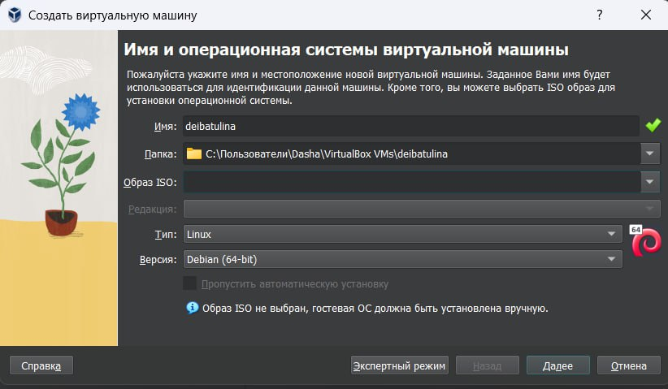
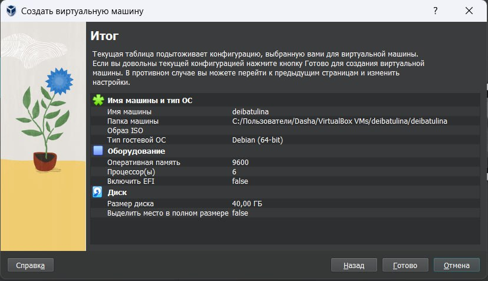
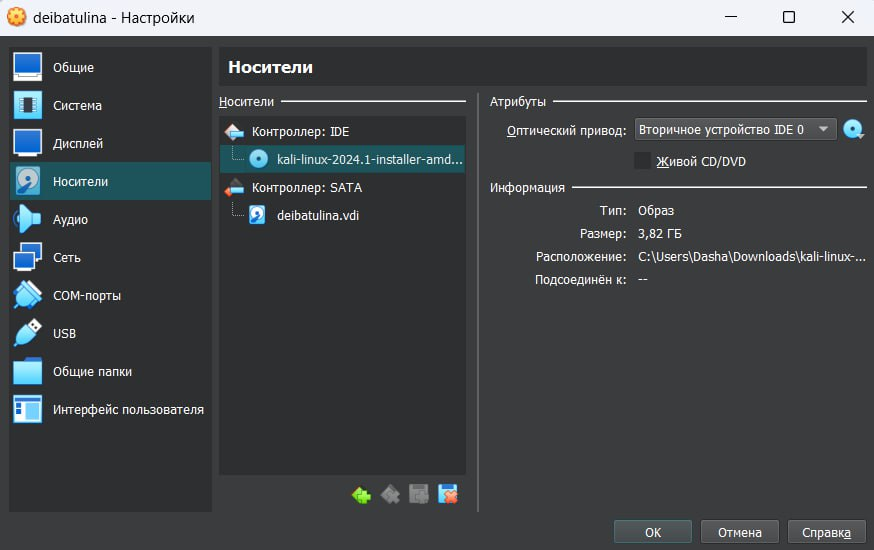
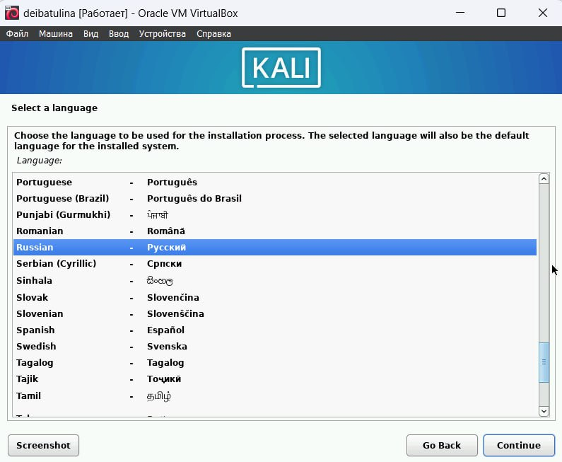
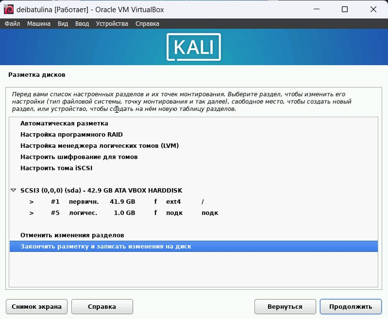
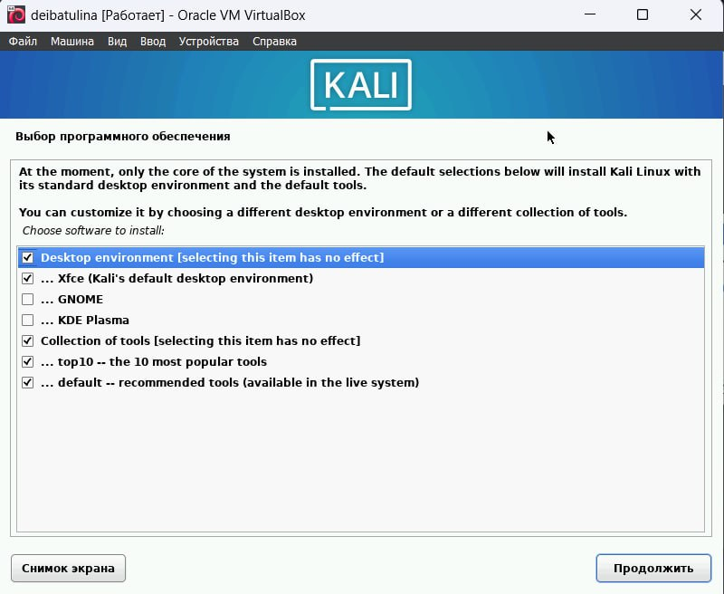
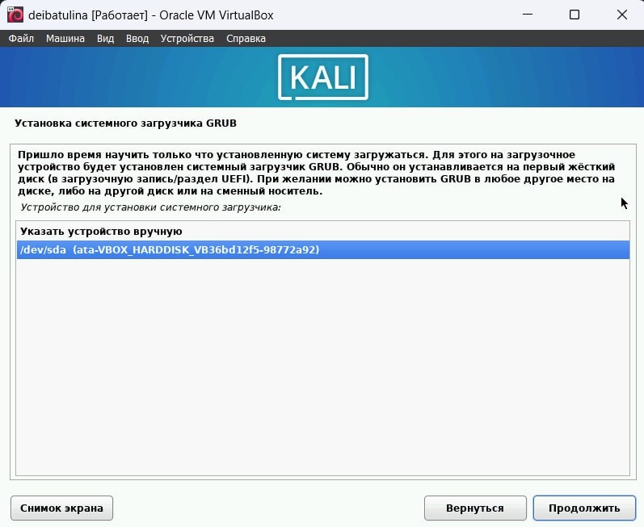
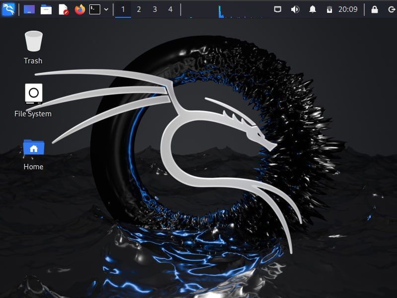

---
## Front matter
lang: ru-RU
title: Первый этап индивидуального проекта
subtitle: Уствновка Kali Linux на Virtual Box
author:
  - Ибатулина Д.Э.
institute:
  - Российский университет дружбы народов, Москва, Россия
  - Объединённый институт ядерных исследований, Дубна, Россия
date: 1 марта 2024

## i18n babel
babel-lang: russian
babel-otherlangs: english

## Formatting pdf
toc: false
toc-title: Содержание
slide_level: 2
aspectratio: 169
section-titles: true
theme: metropolis
header-includes:
 - \metroset{progressbar=frametitle,sectionpage=progressbar,numbering=fraction}
 - '\makeatletter'
 - '\beamer@ignorenonframefalse'
 - '\makeatother'
---

# Информация

## Докладчик

:::::::::::::: {.columns align=center}
::: {.column width="70%"}

  * Ибатулина Дарья Эдуардовна
  * студентка группы НКАбд-01-22
  * факультет физико-математических и естественных наук
  * Российский университет дружбы народов
  * [deibatulina.github.io](mailto:1132226434@pfur.ru)
  * <https://github.com/deibatulina>

:::
::: {.column width="30%"}

:::
::::::::::::::

# Вводная часть

## Актуальность

Навык установки ОС на виртуальную машину является очень важным для специалиста по информационной безопасности. К тому же, ОС Kali Linux активно используется хакерами и специалистами по информационной безопасности по всему миру для проведения хакерских атак и защиты системы.

## Цели и задачи

Установить дистрибутив Kali Linux на вирутальную машину Virtual Box.

# Основная часть

## Создание новой виртуальной машины

Создаю новую вирутальную машину. Выбираю её имя и тип.

## Проверка заданных параметров

Проверяю настроенную конфигурацию виртуальной машины.

## Выбор образа диска

Выбираю образ диска.

## Настройка системы

Выбираю язык системы. Он же будет использоваться и в процессе установки.

## Просмотр настройки разметки диска

Проверяю настройки разметки диска. Всё оставила по умолчанию.

## Выбор программного обеспечения для установки

Выбираю ПО, которое хочу установить. Всё также оставляю без изменений.

## Системный загрузчик GRUB

Устанавливаю системный загрузчик GRUB.

## Интерфейс Kali Linux

Перезагружаю систему и вижу интерфейс установленной ОС.

# Заключительная часть

## Результаты

* установка ОС Kali Linux на вирутальную машину;
* усовершенствование навыка устанвоки ОС на виртуальную машину.

