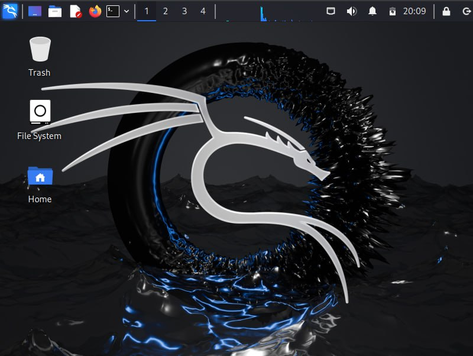

---
## Front matter
title: "Отчёт по первому этапу индивидуального проекта"
subtitle: "Установка Kali Linux на виртуальную машину"
author: "Дарья Эдуардовна Ибатулина"

## Generic otions
lang: ru-RU
toc-title: "Содержание"

## Bibliography
bibliography: bib/cite.bib
csl: pandoc/csl/gost-r-7-0-5-2008-numeric.csl

## Pdf output format
toc: true # Table of contents
toc-depth: 2
lof: true # List of figures
lot: true # List of tables
fontsize: 12pt
linestretch: 1.5
papersize: a4
documentclass: scrreprt
## I18n polyglossia
polyglossia-lang:
  name: russian
  options:
	- spelling=modern
	- babelshorthands=true
polyglossia-otherlangs:
  name: english
## I18n babel
babel-lang: russian
babel-otherlangs: english
## Fonts
mainfont: PT Serif
romanfont: PT Serif
sansfont: PT Sans
monofont: PT Mono
mainfontoptions: Ligatures=TeX
romanfontoptions: Ligatures=TeX
sansfontoptions: Ligatures=TeX,Scale=MatchLowercase
monofontoptions: Scale=MatchLowercase,Scale=0.9
## Biblatex
biblatex: true
biblio-style: "gost-numeric"
biblatexoptions:
  - parentracker=true
  - backend=biber
  - hyperref=auto
  - language=auto
  - autolang=other*
  - citestyle=gost-numeric
## Pandoc-crossref LaTeX customization
figureTitle: "Рис."
tableTitle: "Таблица"
listingTitle: "Листинг"
lofTitle: "Список иллюстраций"
lotTitle: "Список таблиц"
lolTitle: "Листинги"
## Misc options
indent: true
header-includes:
  - \usepackage{indentfirst}
  - \usepackage{float} # keep figures where there are in the text
  - \floatplacement{figure}{H} # keep figures where there are in the text
---

# Цель работы

Установить на виртуальную машину ОС Kali Linux.

# Задание

Установить на виртуальную машину Virtual Box дистрибутив Kali Linux.

# Теоретическое введение

Kali Linux — это дистрибутив операционной системы Linux. Это одна из немногих систем, которая предназначена для специалистов информационной безопасности. В неё входит ряд утилит, которые созданы для тестирования уязвимостей. Kali редко используется как основная ОС, чаще всего она устанавливается как гостевая.

Система Kali Linux была разработана в 2013 году. Над ней работала команда из Offensive Security. За основу была взята структура Debian, а инструменты тестирования информационной безопасности были взяты из ОС BackTrack. Первый релиз был выпущен 13 марта 2013 года.

В комплект Kali входят такие хакерские утилиты как Armitage, nmap, Wireshark, John the Ripper, Aircrack-ng, Burp Suite. С их помощью можно:

* собирать информацию об инфраструктуре объекта. Можно точно определить, какие узлы и сервисы работают в сети, какие операционные системы установлены и как защищена сеть;
* искать уязвимости в системе. Слабые места могут быть в корпоративной сети, базах данных и в программном обеспечении;
* проверять на уязвимость веб-приложения. Можно определить, какая версия CMS установлена на сайте, что позволит использовать уже известные уязвимости для взлома и атак;
* делать брутфорс (Password Attacks). Это метод угадывания пароля или ключа шифрования. Программа перебирает все возможные комбинации символов пока не будет найдена правильная;
* проводить стресс-тесты. Система искусственно нагружается, чтобы выявить все проблемы, которые могут быть вызваны перегрузкой;
* делать спуфинг. Спурфинг (spoofing) — это кибер-атака, в которой мошенник выдаёт себя за какой-либо надёжный источник, чтобы получить доступ к важным данным или информации. Подменяться могут веб-сайты, электронная почта, телефонные звонки, текстовые сообщения, IP-адреса и серверы;
* преобразовывать машинный код в текст программы для восстановления исходного кода;
* устраивать DOS-атаки для Wi-Fi;
* делать бэкдор в системе.
Все утилиты будут готовы к использованию сразу после завершения инсталляции.

# Выполнение лабораторной работы

Создаю новую виртуальную машину. Для этого захожу в Virtual Box и нажимаю: *Машина* -> *Создать*. Задаю имя (логин в дисплейном классе) и тип: *Debian(64-bit)* (рис. [-@fig:001]).

{#fig:001 width=70%}

Выбираю объём основной памяти и количество процессоров. Выбираю практически максимально возможные значения в зелёном диапазоне, чтобы виртуальная машина работала исправно и не зависала. (рис. [-@fig:002]).

{#fig:002 width=70%}

Создаю новый виртуальный жёсткий диск, выделяю объём памяти 40 Гб (рис. [-@fig:003]).

{#fig:003 width=70%}

Проверяю заданные мною параметры новой виртуальной машины (рис. [-@fig:004]).

{#fig:004 width=70%}

Захожу во вкладку *Носители* настроек новой виртуальной машины и выбираю оптический привод (использую заранее скачанный с официального сайта образ ОС Kali Linux) (рис. [-@fig:005]).

{#fig:005 width=70%}

Запускаю виртуальную машину и передо мной пояляется окно настройки системы. Выбираю русский язык в качестве языка установки и системы (рис. [-@fig:006]).

{#fig:006 width=70%}

Выбираю регион (он будет использоваться для настройки часового пояса) (рис. [-@fig:007]).

{#fig:007 width=70%}

Задаю имя компьютера (как логин в дисплейном классе) (рис. [-@fig:008]).

{#fig:008 width=70%}

Настраиваю клавиатуру. В качестве раскладки указываю английско-американскую (рис. [-@fig:009]).

{#fig:009 width=70%}

Задаю имя домена (как логин в дисплейном классе) (рис. [-@fig:010]).

{#fig:010 width=70%}

Создаю учётную запись пользователя, которая будет использоваться вместо учётной записи суперпользователя для выполнения всех действий, не связанных с администрированием (рис. [-@fig:011]).

{#fig:011 width=70%}

Задаю имя пользователя, под которым я буду известна в системе (рис. [-@fig:012]).

{#fig:012 width=70%}

Задаю пароль для пользователя (рис. [-@fig:013]).

{#fig:013 width=70%}

Выбираю часовой пояс (Москва+00) (рис. [-@fig:014]).

{#fig:014 width=70%}

Задаю разметку диска (просто оставляю автонастройки) (рис. [-@fig:015]).

{#fig:015 width=70%}

Выбираю диск для разметки (просто оставляю тот, что выбран по умолчанию) (рис. [-@fig:016]).

{#fig:016 width=70%}

Оставляю без изменений разметку диска (то, что рекомендуется новичкам) (рис. [-@fig:017]).

{#fig:017 width=70%}

Просматриваю заданные параметры разметки диска (рис. [-@fig:018]).

{#fig:018 width=70%}

Появляется окно с подтверждением выбора параметров разметки диска. Нажимаю *Да* (рис. [-@fig:019]).

{#fig:019 width=70%}

Выбираю программное обеспечение для установки (всё просто оставляю по умолчанию) (рис. [-@fig:020]).

{#fig:020 width=70%}

В *установке системного загрузчика GRUB на первичный диск* выбираю *Да* (рис. [-@fig:021]).

{#fig:021 width=70%}

И снова выбираю диск, нажимаю *Продолжить* для дальнейшей перезагрузки системы (рис. [-@fig:022]).

{#fig:022 width=70%}

Появилось окно завершения установки. Извлекать носители нет необходимости, поскольку в настройках виртуальной машины они извлеклись автоматически (рис. [-@fig:023]).

{#fig:023 width=70%}

Система перезагружается, появляется интерфейс (рис. [-@fig:024]).

{#fig:024 width=70%}

# Выводы

В ходе выполнения первого этапа индивидуального проекта я усовершенствовала навык установки ОС на вирутальную машину.

# Список литературы{.unnumbered}

::: {#refs}
:::
