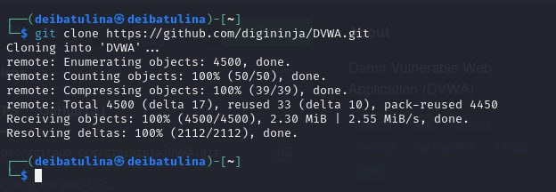
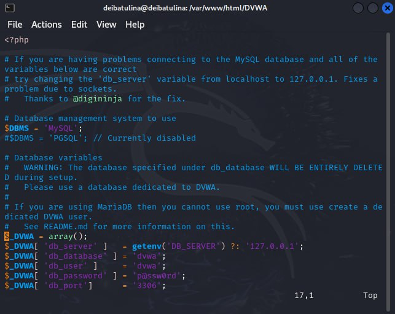
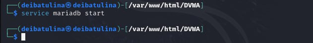
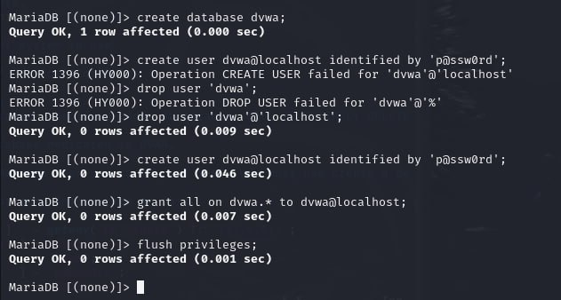
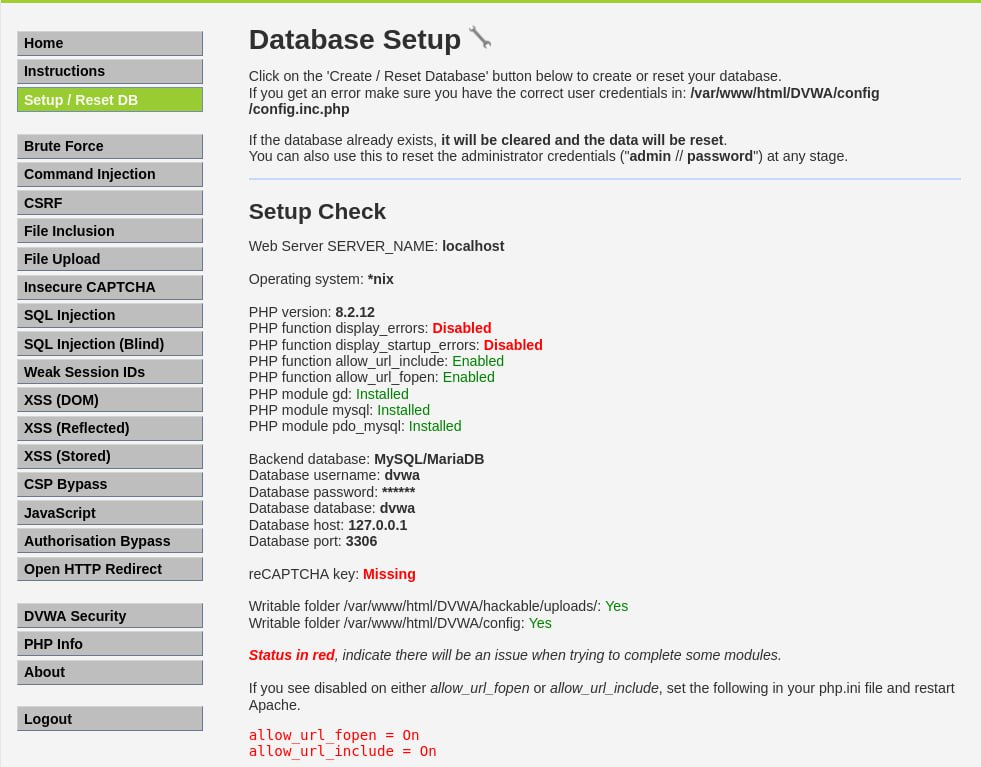

---
## Front matter
lang: ru-RU
title: Второй этап индивидуального проекта
subtitle: Установка DVWA
author:
  - Ибатулина Д.Э.
institute:
  - Российский университет дружбы народов, Москва, Россия
  - Объединённый институт ядерных исследований, Дубна, Россия
date: 14 марта 2024

## i18n babel
babel-lang: russian
babel-otherlangs: english

## Formatting pdf
toc: false
toc-title: Содержание
slide_level: 2
aspectratio: 169
section-titles: true
theme: metropolis
header-includes:
 - \metroset{progressbar=frametitle,sectionpage=progressbar,numbering=fraction}
 - '\makeatletter'
 - '\beamer@ignorenonframefalse'
 - '\makeatother'
---

# Информация

## Докладчик

:::::::::::::: {.columns align=center}
::: {.column width="70%"}

  * Ибатулина Дарья Эдуардовна
  * студентка группы НКАбд-01-22
  * факультет физико-математических и естественных наук
  * Российский университет дружбы народов
  * [deibatulina.github.io](mailto:1132226434@pfur.ru)
  * <https://github.com/deibatulina>

:::
::: {.column width="30%"}

:::
::::::::::::::

# Вводная часть

## Актуальность

DVWA - это веб-приложение на PHP/MySQL, основная цель которого - стать помощником для профессионалов в области безопасности, чтобы проверить свои навыки и инструменты в легальной среде. Мы постарались сделать развертывание DVWA максимально простым и создали надстройку, которую можно легко применить к балансировщику нагрузки edgeNEXUS ALB-X. Для специалиста по информационной безопасности данное приложение - это отличная возможность попрактиковаться и прокачать свои навыки в защите информации (при этом, совершенно легально!).

## Цели и задачи

Установить утилиту DVWA на Kali Linux.

# Основная часть

## Клонирование репозитория

Клонирую репозиторий на гитхабе через терминал. Качается архив с приложением.

## Запуск сервиса apache2

Запускаю сервис apache2.

## Редактирование конфигурационного файла

Задаю нужные параметры в конфиг-файле.

## Запуск сервиса mariadb

Запускаю сервис mariadb.

## Создание базы данных

Создаю и настраиваю базу данных, пользователя и права доступа к ней.

## Проверка выставленных параметров

Проверяю выставленные параметры.

# Заключительная часть

## Результаты

* установила DVWA;
* произвела его первичную настройку.

