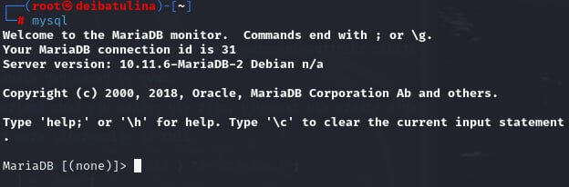

---
## Front matter
title: "отчёт по второму этапу индивидуального проекта"
subtitle: "Установка DVWA"
author: "Дарья Эдуардовна Ибатулина"

## Generic otions
lang: ru-RU
toc-title: "Содержание"

## Bibliography
bibliography: bib/cite.bib
csl: pandoc/csl/gost-r-7-0-5-2008-numeric.csl

## Pdf output format
toc: true # Table of contents
toc-depth: 2
lof: true # List of figures
lot: true # List of tables
fontsize: 12pt
linestretch: 1.5
papersize: a4
documentclass: scrreprt
## I18n polyglossia
polyglossia-lang:
  name: russian
  options:
	- spelling=modern
	- babelshorthands=true
polyglossia-otherlangs:
  name: english
## I18n babel
babel-lang: russian
babel-otherlangs: english
## Fonts
mainfont: PT Serif
romanfont: PT Serif
sansfont: PT Sans
monofont: PT Mono
mainfontoptions: Ligatures=TeX
romanfontoptions: Ligatures=TeX
sansfontoptions: Ligatures=TeX,Scale=MatchLowercase
monofontoptions: Scale=MatchLowercase,Scale=0.9
## Biblatex
biblatex: true
biblio-style: "gost-numeric"
biblatexoptions:
  - parentracker=true
  - backend=biber
  - hyperref=auto
  - language=auto
  - autolang=other*
  - citestyle=gost-numeric
## Pandoc-crossref LaTeX customization
figureTitle: "Рис."
tableTitle: "Таблица"
listingTitle: "Листинг"
lofTitle: "Список иллюстраций"
lotTitle: "Список таблиц"
lolTitle: "Листинги"
## Misc options
indent: true
header-includes:
  - \usepackage{indentfirst}
  - \usepackage{float} # keep figures where there are in the text
  - \floatplacement{figure}{H} # keep figures where there are in the text
---

# Цель работы

Установить DVWA и произвести первичную настройку утилиты.

# Задание

1. Произвести установку утилиты DVWA;
2. Настроить утилиту;
3. Проверить, всё ли установлено правильно.

# Теоретическое введение

DVWA - это веб-приложение на PHP/MySQL, основная цель которого - стать помощником для профессионалов в области безопасности, чтобы проверить свои навыки и инструменты в легальной среде. Мы постарались сделать развертывание DVWA максимально простым и создали надстройку, которую можно легко применить к балансировщику нагрузки edgeNEXUS ALB-X.

# Выполнение лабораторной работы

Клонирую репозиторий с DVWA на гитхабе (скачивается архив) (рис. [-@fig:001]).

{#fig:001 width=70%}

Через учётную запись администратора перемещаю уилиту в указанную директорию (рис. [-@fig:002]).

{#fig:002 width=70%}

Произвожу проверку выполненных действий (рис. [-@fig:003]).

{#fig:003 width=70%}

Запускаю сервис *apache2* (рис. [-@fig:004], [-@fig:005]).

{#fig:004 width=70%}

{#fig:005 width=70%}

Копираю конфигурационный файл в нужную директорию (рис. [-@fig:006]).

{#fig:006 width=70%}

Редактирую конфигурационный файл в текстовом редакторе *vim* (рис. [-@fig:007], [-@fig:008]).

{#fig:007 width=70%}

{#fig:008 width=70%}

Проверяю выставленные параметры в браузере, логинясь через учётную запись *admin* с паролем *password* (рис. [-@fig:009]).

{#fig:009 width=70%}

Запускаю сервис *mariiadb* (рис. [-@fig:010]).

{#fig:010 width=70%}

Переключившись на учетную запись администратора, запускаю mysql (рис. [-@fig:011]).

{#fig:011 width=70%}

Создаю базу данных (рис. [-@fig:012]).

{#fig:012 width=70%}

Ввожу пароль от базы данных (рис. [-@fig:013]).

{#fig:013 width=70%}

Настраиваю нужные параметры (рис. [-@fig:014], [-@fig:015], [-@fig:016], [-@fig:017]).

{#fig:014 width=70%}

{#fig:015 width=70%}

{#fig:016 width=70%}

{#fig:017 width=70%}

Проверяю выставленные настройки (рис. [-@fig:018]).

{#fig:018 width=70%}

# Выводы

Установила DVWA и произвела её первичную настройку.

# Список литературы{.unnumbered}

::: {#refs}
:::
