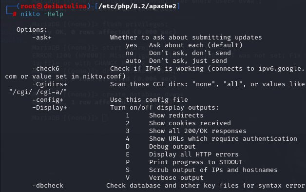
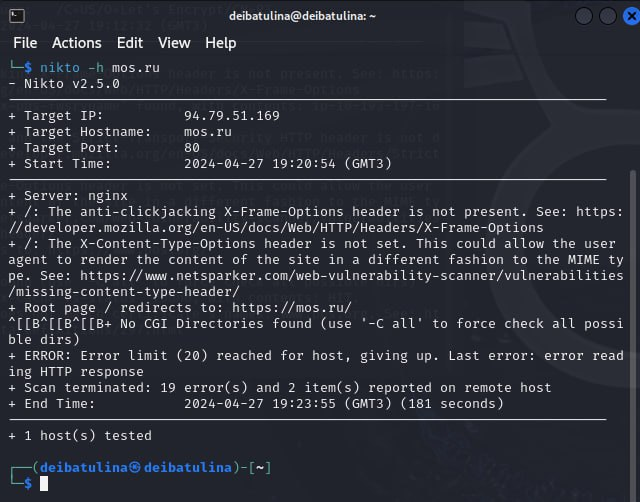
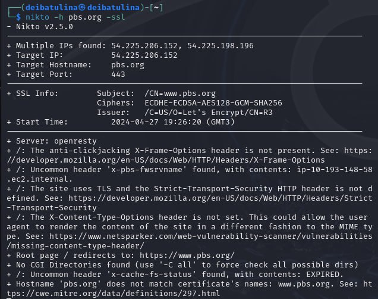
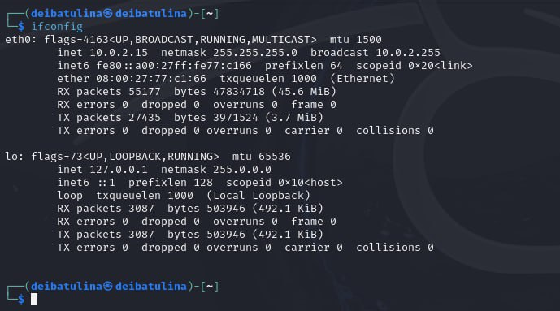
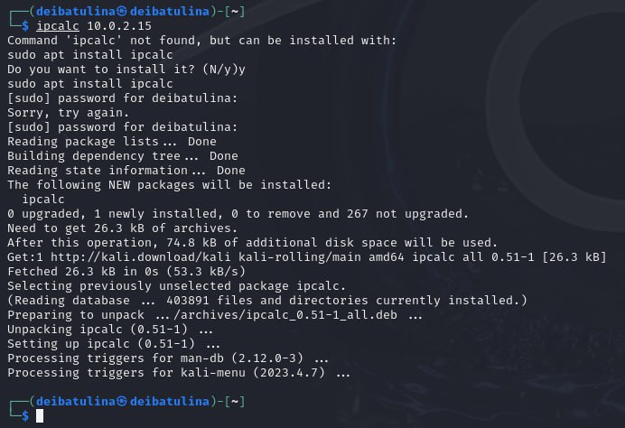

---
## Front matter
lang: ru-RU
title: Четвертый этап индивидуального проекта
subtitle: Использование nikto
author:
  - Ибатулина Д.Э.
institute:
  - Российский университет дружбы народов, Москва, Россия
  - Объединённый институт ядерных исследований, Дубна, Россия
  

date: 27 апреля 2024

## i18n babel
babel-lang: russian
babel-otherlangs: english

## Formatting pdf
toc: false
toc-title: Содержание
slide_level: 2
aspectratio: 169
section-titles: true
theme: metropolis
header-includes:
 - \metroset{progressbar=frametitle,sectionpage=progressbar,numbering=fraction}
 - '\makeatletter'
 - '\beamer@ignorenonframefalse'
 - '\makeatother'
---

# Информация

## Докладчик

:::::::::::::: {.columns align=center}
::: {.column width="70%"}

  * Ибатулина Дарья Эдуардовна
  * студентка группы НКАбд-01-22
  * факультет физико-математических и естественных наук
  * Российский университет дружбы народов
  * [deibatulina.github.io](mailto:1132226434@pfur.ru)
  * <https://github.com/deibatulina>

:::
::: {.column width="30%"}

:::
::::::::::::::

# Вводная часть

## Актуальность

Навык работы с nikto является очень важным для специалиста по информационной безопасности. К тому же, ОС Kali Linux активно используется хакерами и специалистами по информационной безопасности по всему миру для проведения хакерских атак и защиты системы.

## Цели и задачи

Целями работы является: получение знаний о том, для чего используется nikto, сканирование веб-сайта, поиск уязвимостей в нем.

# Основная часть

## Теоретическое введение

Nikto – это простой открытый сканер веб-серверов, который проверяет веб-сайт и сообщает о найденных уязвимостях, которые могут быть использованы для эксплойта или взлома. Кроме того, это один из наиболее широко используемых инструментов сканирования веб-сайтов на уязвимости во всей отрасли, а во многих кругах он считается отраслевым стандартом.

## Вызов справки по nikto

Для начала следует установить nikto. Однако, я использую дистрибутив Kali Linux, а в нем nikto уже предустановлен. Чтобы в этом убедиться, вызову справку командой `nikto -Help`:

## Сканирование сайта мэра Москвы

Затем для классического сканирования сайта буду использовать базовый синтаксис `nikto -h <IP или hostname>` с фактическим IP-адресом или именем хоста без угловых скобок. Просканирую таким образом сайт мэра Москвы:

## Сканирование сайта *pbs.org* с SSL

Далее, сканирую сайт *pbs.org* с SSL командой `nikto -h pbs.org -ssl`:

## Сканирование IP-адреса с помощью ifconfig

Теперь, когда я провела быстрое сканирование веб-сайта, можно попробовать использовать Nikto в локальной сети, чтобы найти embedded-сервера, такие как страница логина роутера или HTTP-сервис на другой машине, который представляет из себя просто сервер без веб-сайта. Чтобы узнать IP-адрес, я буду использовать ifconfig: `ifconfig`:

## Использование IpCalc для IP-адреса

IP-адрес, который мне нужен, относится к «inet». На нем можно использовать ipcalc для того, чтобы получить сетевой диапазон. Если у ipcalc не установлен, необходимо установить его с помощью команды `apt install ipcalc`, а затем повторить попытку. Диапазон будет стоять после «Network», в моем случае это 10.0.2.15:

# Заключительная часть

## Результаты

В результате выполнения лабораторной работы я получила практические навыки работы с nikto, а также узнала, для чего он используется.

