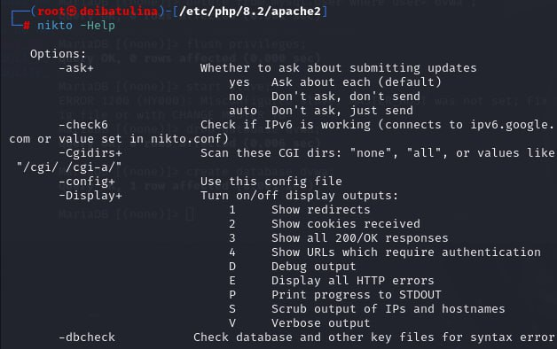
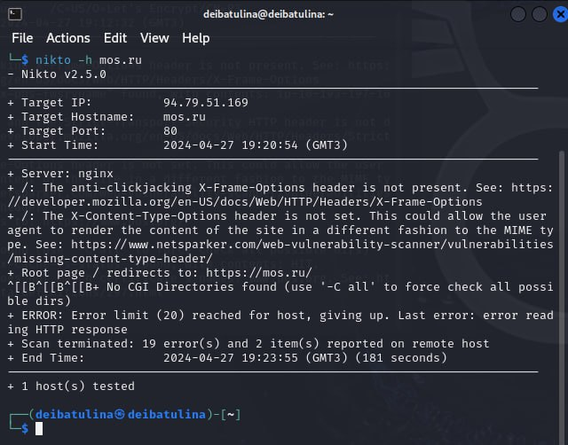
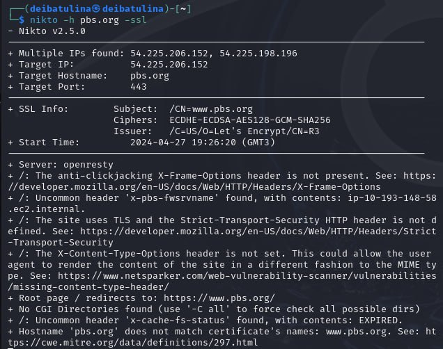
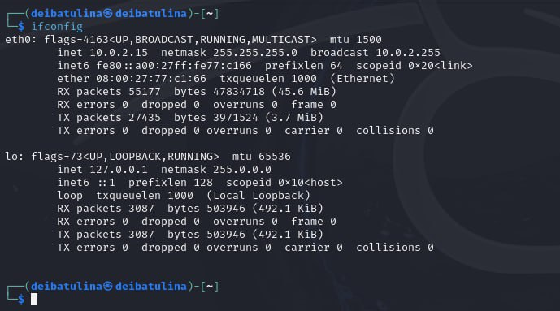
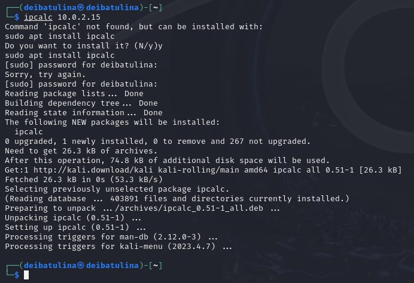

---
## Front matter
title: "Индивидуальный проект. Этап 4"
subtitle: "Использование nikto"
author: "Дарья Эдуардовна Ибатулина"

## Generic otions
lang: ru-RU
toc-title: "Содержание"

## Bibliography
bibliography: bib/cite.bib
csl: pandoc/csl/gost-r-7-0-5-2008-numeric.csl

## Pdf output format
toc: true # Table of contents
toc-depth: 2
lof: true # List of figures
lot: true # List of tables
fontsize: 12pt
linestretch: 1.5
papersize: a4
documentclass: scrreprt
## I18n polyglossia
polyglossia-lang:
  name: russian
  options:
	- spelling=modern
	- babelshorthands=true
polyglossia-otherlangs:
  name: english
## I18n babel
babel-lang: russian
babel-otherlangs: english
## Fonts
mainfont: PT Serif
romanfont: PT Serif
sansfont: PT Sans
monofont: PT Mono
mainfontoptions: Ligatures=TeX
romanfontoptions: Ligatures=TeX
sansfontoptions: Ligatures=TeX,Scale=MatchLowercase
monofontoptions: Scale=MatchLowercase,Scale=0.9
## Biblatex
biblatex: true
biblio-style: "gost-numeric"
biblatexoptions:
  - parentracker=true
  - backend=biber
  - hyperref=auto
  - language=auto
  - autolang=other*
  - citestyle=gost-numeric
## Pandoc-crossref LaTeX customization
figureTitle: "Рис."
tableTitle: "Таблица"
listingTitle: "Листинг"
lofTitle: "Список иллюстраций"
lotTitle: "Список таблиц"
lolTitle: "Листинги"
## Misc options
indent: true
header-includes:
  - \usepackage{indentfirst}
  - \usepackage{float} # keep figures where there are in the text
  - \floatplacement{figure}{H} # keep figures where there are in the text
---

# Цель работы

Целью работы являются: получение знаний о том, для чего используется nikto, сканирование веб-сайта, поиск уязвимостей в нем.

# Задание

1. Вызвать справку по nikto;
2. Просканировать любой сайт;
3. Просканировать любой сайт с ssl4
4. Выяснить свой IP-адрес.

# Теоретическое введение

Перед тем как атаковать любой сайт, хакер или пентестер сначала составляет список целей. После того, как он проведет хорошую разведку и найдет слабые места для «наведения прицела», ему понадобится инструмент сканирования веб-сервера, такой как Nikto, который поможет найти уязвимости – потенциальные вектора атаки.

Nikto – это простой открытый сканер веб-серверов, который проверяет веб-сайт и сообщает о найденных уязвимостях, которые могут быть использованы для эксплойта или взлома. Кроме того, это один из наиболее широко используемых инструментов сканирования веб-сайтов на уязвимости во всей отрасли, а во многих кругах он считается отраслевым стандартом.

Несмотря на то, что этот инструмент чрезвычайно эффективен, он не действует скрытно. Любой сайт с системой обнаружения вторжений или иными мерами безопасности поймет, что его сканируют. Nikto был разработан для тестирования безопасности и о скрытности его работы никто не задумывался.

**Как правильно использовать Nikto**

Если вы просто запустите Nikto на целевом веб-сайте, вы, возможно, не поймете, что делать с информацией, полученной после сканирования. Nikto на самом деле больше похож на лазерную указку, которая влечет за собой выстрел, и через некоторое время вы увидите, как это работает.

Для начала давайте поговорим о целях (target). Целью может оказаться почти любое место, куда может нанести свой удар хакер, например, сетевые принтеры или веб-сервер. Когда мы чуть позже перейдем к использованию Nikto, нам нужно будет предоставить ему один из трех видов информации: IP-адрес для локальной службы, веб-домен для атаки или веб-сайт SSL/HTTPS.

Прежде чем начинать сканирование с помощью Nikto, лучше предварительно провести разведку с помощью такого открытого инструмента как Maltego. Такие инструменты могут оказаться полезными при создании профиля и формировании более конкретного списка целей, на которых стоит сосредоточиться. Как только вы это сделаете, можно будет воспользоваться Nikto для поиска потенциальных уязвимостей в целях из вашего списка.

Если повезет, уязвимость с известным эксплойтом будет найдена, а значит, что уже существует инструмент, который поможет воспользоваться этим слабым местом. С помощью соответствующего инструмента, который автоматически эксплуатирует уязвимость, хакер может получить доступ к цели для выполнения любого количества скрытых атак, таких как, например, добавление вредоносного кода [1].

# Выполнение лабораторной работы

1. Для начала следует установить nikto. Однако, я использую дистрибутив Kali Linux, а в нем nikto уже предустановлен. Чтобы в этом убедиться, вызову справку командой `nikto -Help` (рис. [-@fig:001]).

{#fig:001 width=70%}

2. Затем для классического сканирования сайта буду использовать базовый синтаксис `nikto -h <IP или hostname>` с фактическим IP-адресом или именем хоста без угловых скобок. Просканирую таким образом сайт мэра Москвы (рис. [-@fig:002]).

{#fig:002 width=70%}

3. Далее, сканирую сайт *pbs.org* с SSL `nikto -h pbs.org -ssl` (рис. [-@fig:003]).

{#fig:003 width=70%}

4. Теперь, когда я провела быстрое сканирование веб-сайта, можно попробовать использовать Nikto в локальной сети, чтобы найти embedded-сервера, такие как страница логина роутера или HTTP-сервис на другой машине, который представляет из себя просто сервер без веб-сайта. Чтобы узнать IP-адрес, я буду использовать ifconfig: `ifconfig` (рис. [-@fig:004]).

{#fig:004 width=70%}

5. IP-адрес, который мне нужен, относится к «inet». На нем можно использовать ipcalc для того, чтобы получить сетевой диапазон. Если у ipcalc не установлен, необходимо установить его с помощью команды `apt install ipcalc`, а затем повторить попытку. Диапазон будет стоять после «Network», в моем случае это 10.0.2.15 (рис. [-@fig:005]).

{#fig:005 width=70%}

# Выводы

В результате выполнения лабораторной работы я получила практические навыки работы с nikto, а также узнала, для чего он используется.

# Список литературы{.unnumbered}

[1] Статья: Проверяем на уязвимости любой сайт с помощью Nikto. URL: https://habr.com/ru/companies/otus/articles/492546/ [Дата обращения 27.04.2024]

::: {#refs}
:::
